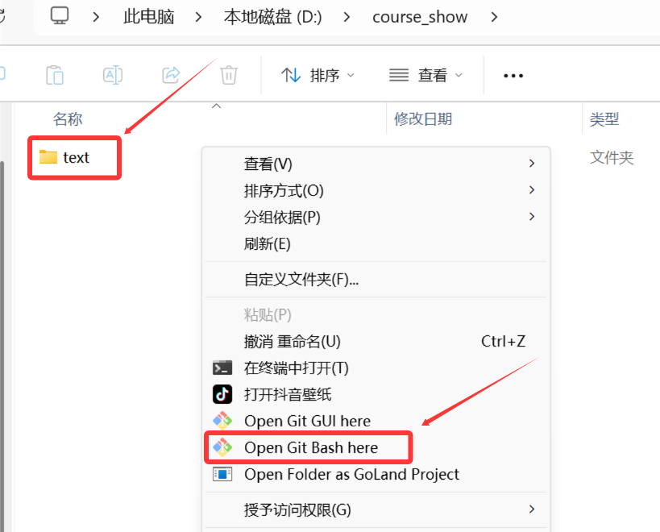
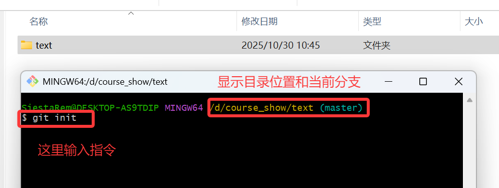
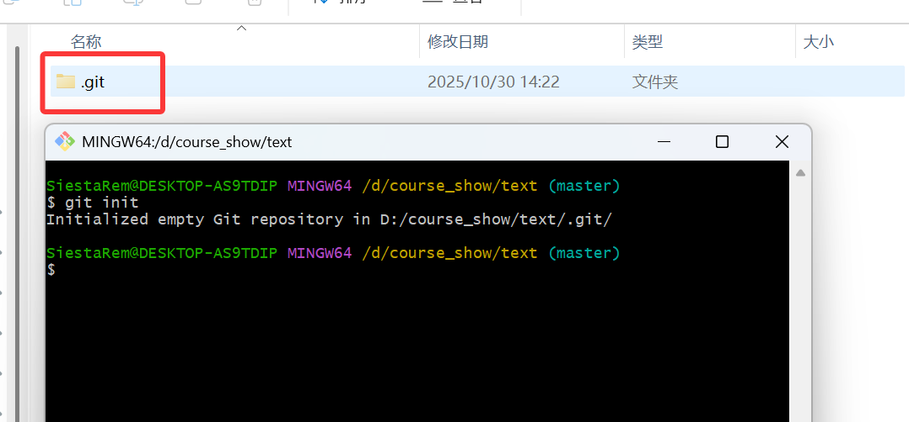
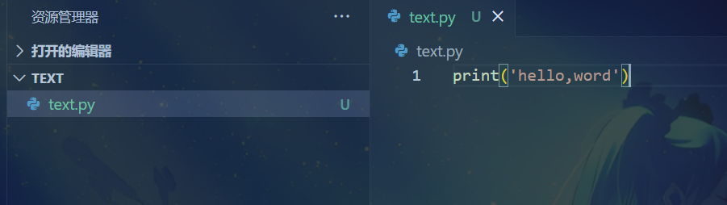
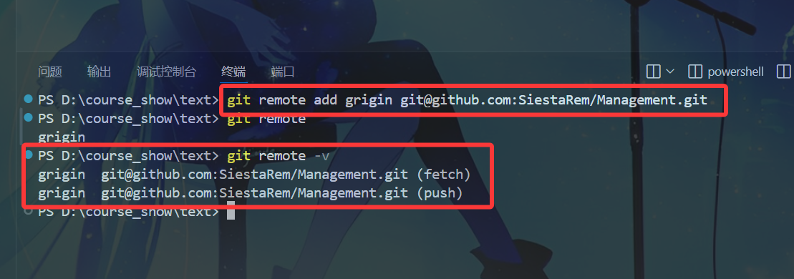
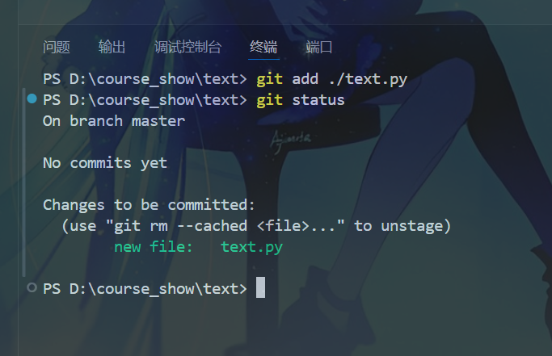
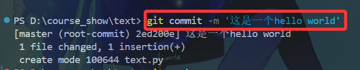
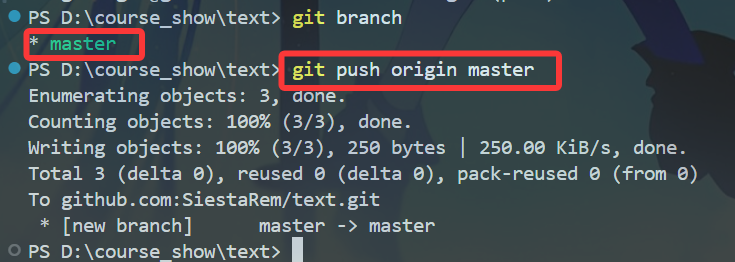
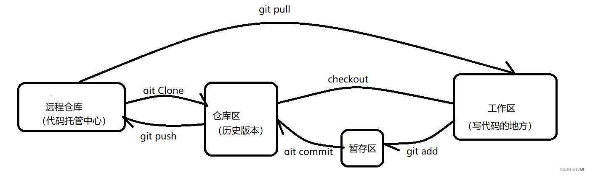
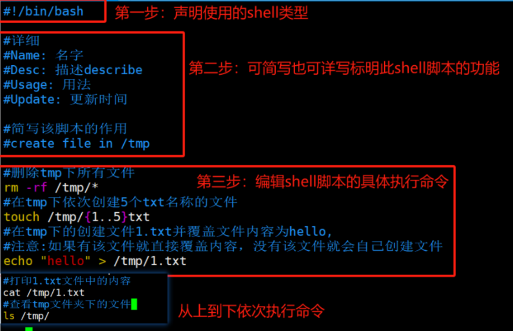

# 什么是git
Git 是一个分布式版本控制系统。你可以把它想象成一个极其强大的“时光机”和“协作工具”，专门用于管理你的文件（尤其是代码文件）的每一次改动。

## git可以做什么
- 备份与回滚： 再也不用担心改错代码，可以轻松回到任何一个正常工作的时间点。

- 协作开发： 多人可以在同一个项目上并行工作，最后再合并各自的功能，极大提升效率。

- 分支管理： 你可以创建一个项目的“平行宇宙”（分支），在新分支上开发实验性功能，而不会影响主线（主分支）的稳定。功能完成后，再合并回主线。

- 责任追溯： 每一行代码是谁、在什么时候、为什么修改的，都记录得清清楚楚。


# git安装
## 下载地址
[官方链接](https://git-scm.com/)  
关于git的详细安装方法网上有很多，大家可以自行搜索一下  
[一个下载教程链接](https://blog.csdn.net/2508_90580492/article/details/148584106?fromshare=blogdetail&sharetype=blogdetail&sharerId=148584106&sharerefer=PC&sharesource=RemSiesta&sharefrom=from_link)  

# Git 常用命令速查表

| Git 命令 | 功能说明 |
|:---------|:---------|
| **基础配置** | |
| `git config --global user.name "用户名"` | 设置全局用户名 |
| `git config --global user.email "邮箱"` | 设置全局邮箱 |
| `git config --list` | 查看所有配置 |
| **仓库操作** | |
| `git init` | 初始化本地仓库 |
| `git clone 仓库地址` | 克隆远程仓库 |
| `git remote add origin 仓库地址` | 添加远程仓库 |
| **基础工作流** | |
| `git status` | 查看状态 |
| `git add 文件名` | 添加文件到暂存区 |
| `git add .` | 添加所有文件到暂存区 |
| `git commit -m "提交信息"` | 提交到本地仓库 |
| `git commit -am "提交信息"` | 添加并提交所有已跟踪文件 |
| **查看信息** | |
| `git log` | 查看提交历史 |
| `git log --oneline` | 简洁版提交历史 |
| `git reflog` | 查看所有操作记录 |
| `git diff` | 查看文件差异 |
| **分支管理** | |
| `git branch` | 查看分支 |
| `git branch 分支名` | 创建分支 |
| `git checkout 分支名` | 切换分支 |
| `git checkout -b 新分支名` | 创建并切换分支 |
| `git merge 分支名` | 合并分支 |
| `git branch -d 分支名` | 删除分支 |
| **远程操作** | |
| `git push origin 分支名` | 推送到远程仓库 |
| `git push -u origin 分支名` | 首次推送并建立关联 |
| `git pull origin 分支名` | 拉取远程更新 |
| `git fetch origin` | 获取远程更新 |
| **撤销操作** | |
| `git reset --hard 版本号` | 版本穿梭 |
| `git checkout -- 文件名` | 撤销工作区修改 |
| `git reset HEAD 文件名` | 撤销暂存区修改 |
| `git commit --amend` | 修改最近一次提交 |

## 基本操作
### 下面我演示一个通过git上传代码到github的案例


如图右击你的项目，再点击标识的图标(这里如果没有的话可以选择更多选项里看看有没有) 

这里说明一下，图上的bash是git专门提供的，其实我们正常的终端也可以使用git命令，但是在git的终端里可以**使用一些linux的指令**，如"ls,vimkdir,rm...",而且还有**文件的颜色区别**，正常使用时在哪都可以



在上面输入 `git init` 并回车就可以完成初始化之后会有一个 .git 文件(没有的话可能被隐藏了，可以设置一下)，接下来就可以方便的使用git提交并管理代码了



下面讲一下这个文件有什么用
- 之后所有的版本都会放到.git文件夹中
- 比拷贝省空间，第一次提交commit会都放进来，之后每一次commit只把修改的内容保存进来


这里创建一个文件并写入了一段'hello,world'


接下来我们需要连接到github上面创建的远程仓库
在图上类似git@github.com:yourname/yourregistory.git的为仓库的地址


接下来我们在终端`git add` 文件，可以使用 `git status` 来查看文件状态

  
再使用`git commit (-m 参数可以添加一些备注)`


上面`git branch`查看本地分支，再`git push [远程分支] [本地分支]`推送上去



## 结语
git我们主要是作为一个代码工具来使用，我们需要有一个基本的认识和掌握，很多时候不懂或者忘记了也可以在网上搜索，这里我也只是简单带大家入门，而且在pycharm，vscode等上面都有图形化界面，甚至点一点就行了
  
  
  
  
## shell编程是什么
- Shell 是操作系统与用户之间的桥梁，它接收用户输入的命令，并调用系统内核去执行相应的任务。
- Shell 命令是 Linux 系统操作的核心工具，比如我们常用的 ls、cd、cp、echo 等命令，都是在 Shell 中运行的指令。
- Shell编程就是一系列的shell命令，他们放在一个.sh的文件里面，将其变为一个可执行的"任务集合"

## shell编程与运维的关系
运维工作中充斥着大量重复性的与服务器打交道的任务，Shell脚本的核心价值就是将其**自动化**和**效率提升**。  

**对比示例**  

- **手动操作（低效）**：每天登录服务器 -> 检查磁盘空间 -> 检查服务状态 -> 备份关键数据 -> 清理临时文件。
- **Shell脚本（高效）**：编写一个 daily_check.sh 脚本，包含所有上述命令。然后使用 cron（Linux定时任务工具）设定每天凌晨自动执行。从此，运维人员只需查看脚本生成的日志报告即可。
  
## shell脚本编写方法
### shell脚本的构成  

- **shebang 行**：指定脚本的解释器。
- **变量定义**：声明脚本中使用的变量。
- **函数定义(可选择)**：定义脚本中的功能模块。
- **主程序**：执行具体操作的代码。 
 

  
### shell脚本的运行
- 创建`.sh`结尾的文件 如`test.sh`
- 添加执行权限：`chmod +x test.sh`
- 运行脚本：
   -- `./test.sh`（需要Shebang行和执行权限）
   -- `bash test.sh`（不需要Shebang行和执行权限）

### 基本变量类型
- **字符串（String）**：默认情况下，Shell变量都是字符串。即使你赋值一个数字，它也是以字符串形式存储。
- **整数（Integer）**：在Shell中，可以使用`declare -i`或`typeset -i`将变量声明为整数。这样，在算术运算中可以直接使用，而无需使用$(( ))或let。
- **数组（Array）**：Shell支持一维数组，数组元素可以是字符串或整数。数组的索引从0开始。
- **关联数组（Associative Array）**：类似于其他语言中的字典或映射，使用字符串作为索引（键）。在Bash 4.0及以上版本支持。
- **只读变量（Read-only）**：使用readonly声明的变量不能被修改或删除。
- **环境变量（Environment Variables）**：这些变量可以从父进程传递给子进程，通常用于配置Shell和脚本的行为。  
    
### 常用语句
- 输出 `echo 参数 [字符串]`  
  -- -n 不换行输出  
  -- -e 启用转义符  
  -- -E 禁用转义符  

- 输入 `read 变量`
  
  -- -p 显示提示信息  
  -- -s 静默模式  
  -- -t 设置超时时间  
  -- -n 限制输入字数  
  -- -r 不启用转义符  
  -- -a 读取为数组  

- 格式化输出 `printf 字符串 参数...`
  
- if判断语句 
  ```
    if 条件; then
        # 代码块
    elif 条件; then
        # 代码块
    else
        # 代码块
    fi
  ```  

- case判断  
  
  ```
  case 变量 in
      模式1)
          # 执行代码
          ;;
      模式2)
          # 执行代码
          ;;
      *)
          # 默认执行代码
          ;;
  esac
  ```  

  -- 案例  

  ```
  #!/bin/bash

    echo "请输入一个水果名称:"
    read fruit

    case $fruit in
        "apple")
            echo "这是苹果"
            ;;
        "banana")
            echo "这是香蕉"
            ;;
        "orange")
            echo "这是橙子"
            ;;
        *)
            echo "未知水果"
            ;;
    esac
  ```  

- 逻辑运算符  
  
  -- 与运算 `&&`  
  -- 或运算 `||`  
  -- 非运算 `！`  

- while循环  
  
  ```
    while 条件; do 
        # 代码块
    done
  ```
- until循环
  ```
  until 条件; do
      # 代码块
  done
  ```
- break和continue语句  
  -- `break`:终止循环  
  -- `continue`:跳过本次循环
   
- 函数function
  ```
  # 两种写法
  function_name() {
      # 代码块 (参数形式 $1 $2...)
      return 值
  }

  function function_name {
      # 代码块 (参数形式 $1 $2...)
      return 值
  }

  # 调用
  function_name 参数1 参数2

  ```
  -- 案例
  ```
  #!/bin/bash

  show_params() {
      echo "脚本名: $0"      
      echo "参数个数: $#"
      echo "所有参数: $@"
      echo "所有参数: $*"
      echo "第一个参数: $1"
      echo "第二个参数: $2"
      echo "最后一个参数: ${@: -1}"
  }

  show_params "one" "two" "three" "four"
  ```

## 小结
这里只是简单的介绍了一下shell这门脚本语言，希望大家能自己下去继续学习一下，不管是文档还是网课，可以多试一下，思考一下shell语言在哪种情况可以提高效率。  
运维的日常工作中shell还是会经常使用到的

作业:  
level0：了解课上的shell和git相关知识，下载好git  
level1：试着通过运行shell脚本来执行一些命令(比如创建并打开文件向里面写一个'hello，world'并输出到终端)  
level2：用shell做一个石头剪刀布的脚本  
level3：尝试使用git上传作业，把自己的github(gitee也可以)地址用邮箱发过来

作业发送邮箱： *tantao@lanshan.email* 