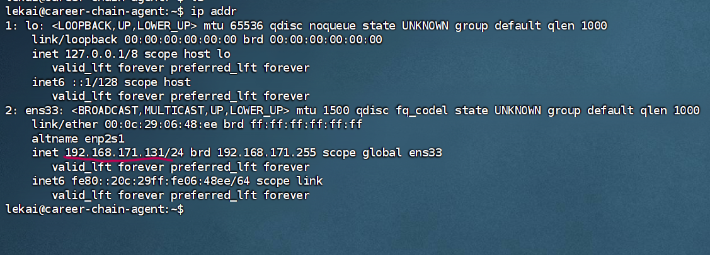
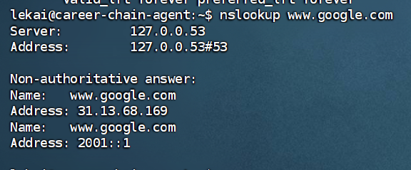
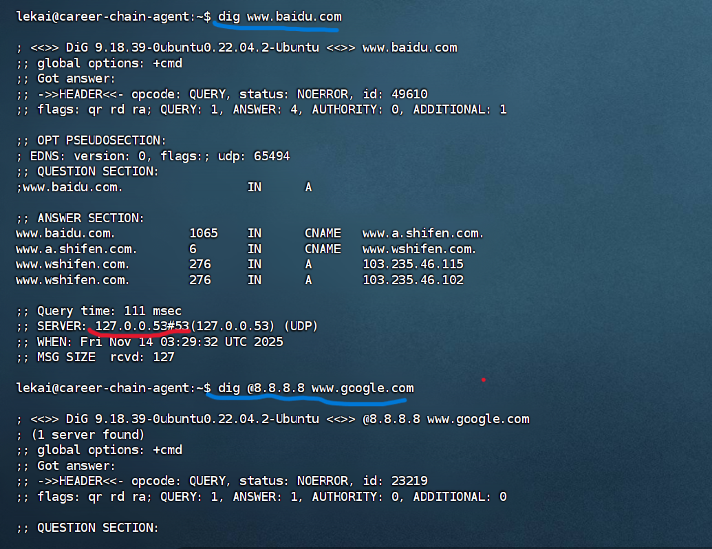
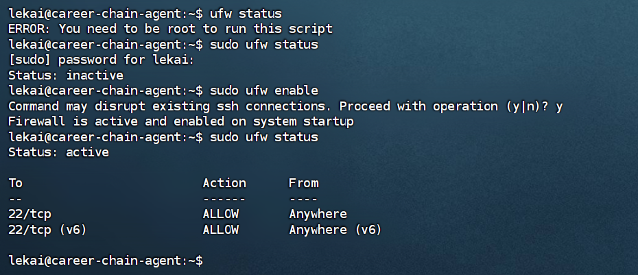
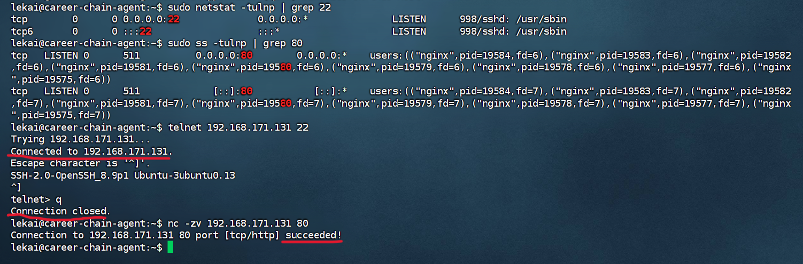

# 计算机网络方面的一些小补充

由于我们主课件中理论性偏强，所以这个课件是作为计算机网络中一些偏向实践的方面的补充。以免大家觉得计算机网络好似空中楼阁，索然无味。

## 1. IP地址（网络世界的身份证）

**（1）IP地址** 的全称是 **Internet Protocol Address**，即 **互联网协议地址**。

它是分配给网络设备（如电脑、手机、服务器、智能家居设备等）的一个**唯一的、逻辑上的地址标识**。它使得设备之间能够相互定位和通信。在同一个网络中，每个设备的IP地址必须是唯一的，否则就会像两个家庭共用一个门牌号，快递员会送错地方，导致网络通信混乱。

怎么查看自己服务器上的IP地址呢？

```shell
ip addr  #Linux
ipconfig #Windows
ifconfig #mac
```



##### **（2）IP地址的格式与构成**

我们目前最广泛使用的IP地址版本是 **IPv4**，它看起来像这样：

```shell
192.168.1.105
```

- **点分十进制**：由4个介于0到255之间的数字组成，中间用点号`.`分隔。
- **本质是二进制**：计算机实际处理的是32位的二进制数。上面的地址在计算机看来是：`11000000.10101000.00000001.01101001`。点分十进制只是为了方便我们人类记忆和书写(人性化这块，有点感动吧)。

**（3）未来之星——IPv6**

由于IPv4地址总量（约43亿个）即将耗尽（稀缺货，所以现在家里安装宽带，一般不会分配公网IPv4给你），我们正在向 **IPv6** 过渡。

- **格式**：`2001:0db8:85a3:0000:0000:8a2e:0370:7334`
- **特点**：地址数量极其庞大（号称"可以为地球上的每一粒沙子分配一个IP地址"），从根本上解决了地址耗尽问题。

课下：可以自己了解一下公网ip和私网ip的区别，也可以去了解一下域名和ip地址的区别和联系。

## 2. DNS**（Domain Name System）**

**DNS**全称 **域名系统**。

- 它是互联网的一项核心服务，作为一个**分布式数据库**，它承担着将**域名**和**IP地址**相互映射的责任。有了它，用户不再需要记忆复杂的IP地址串，只需记住简单的域名即可上网。如果你访问百度，CSDN需要记住它们的服务器ip地址，然后才能使用浏览器访问，这个应该很难受吧。

- 一个域名可以对应多个IP地址（这就是为什么我们成千上万的人访问Github，而它不会崩盘，因为它域名的背后是一个庞大的服务器集群，我们的访问请求被分配到了不同的服务器。现在是否感觉到了运维工程师的重要性呢？），DNS可以轮询返回不同IP，将访问流量分散到多台服务器上。

- DNS解析常见的Linux命令，它们可以解析域名背后的服务器IP地址。

  - **nslookup**

    ```shell
  nslookup 域名
    #示例：nslookup www.google.com
    #命令输出解析：
    Server:         192.168.1.1        # 你使用的本地DNS服务器地址
    Address:        192.168.1.1#53     # DNS服务器IP和端口（53）
    
    Non-authoritative answer:           # 非权威应答（来自缓存，非域名管理者）
    Name:   www.google.com
    Address: 142.251.42.196            # 解析出的IP地址
    ```
    
    

  - **dig**

    ```shell
    # dig 域名 (第一种用法,单纯析取)
    dig www.baidu.com
    #命令输出解析
    ; <<>> DiG 9.16.1 <<>> www.baidu.com
    ;; QUESTION SECTION:               # 你的查询问题
    ;www.baidu.com.           IN      A
    
    ;; ANSWER SECTION:                 # DNS服务器返回的答案
    www.baidu.com.     7200    IN      CNAME   www.a.shifen.com.
    www.a.shifen.com.  300     IN      A       110.242.68.4
    www.a.shifen.com.  300     IN      A       110.242.68.3
    
    ;; Query time: 48 msec             # 查询耗时
    ;; SERVER: 192.168.1.1#53(192.168.1.1) # 使用的DNS服务器
    
    #dig @DNS服务器 域名 (第二种用法，制定DNS服务器解析)
    dig @8.8.8.8 www.google.com        # 使用Google DNS查询
    dig @1.1.1.1 www.cloudflare.com    # 使用Cloudflare DNS查询
    
    #dig 域名 +short    (第三种用法，添加short,使输出精简化)
    dig www.google.com +short
    # 输出：仅IP地址，适合脚本中使用
    
    #dig 域名 +trace    (第四种用法，跟踪DNS解析全过程)
    #这个命令会模拟完整的DNS解析流程，从根服务器开始，一步步展示查询过程，非常有助于理解DNS的层次结构。
    dig www.github.com +trace
    ```
    
    

###### 其实nslookup和dig有很多用法，但是篇幅有限，就介绍几种比较常用的。

## 3. 防火墙

**防火墙** 是一种网络安全系统，它根据预定义的安全规则，**监控并控制进出网络的数据流**。它可以是硬件、软件或两者的结合。

#### **防火墙的核心作用**

1. **访问控制** - **"谁能进，谁能出"**
   - 允许正常的网络流量（如网页浏览、邮件收发）。
   - 阻止未经授权的访问尝试（如黑客攻击）。
2. **端口管理** -"**服务可以被访问的接口**"
   - 网络服务通过"端口"对外提供。SSH用22端口，Nginx用80端口。
   - 防火墙可以只开放必要的端口，其他端口全部关闭，减少攻击面。
3. **流量过滤** - **"检查进入服务器的内容"**
   - 可以根据IP地址、协议类型等规则过滤流量。
   - 例如："只允许公司内部IP访问管理后台"。
4. **网络地址转换** - **"隐藏内部结构"**
   - 保护内部网络拓扑，外部无法直接看到内部机器。

**Ubuntu中的防火墙是ufw，运维人员一般通过ufw管理服务器的防火墙情况**

```shell
#检查服务器状态
sudo ufw status

# 启用防火墙（默认拒绝所有进入连接，允许所有传出连接）
sudo ufw enable

# 关闭防火墙
sudo ufw disable

# 允许通过IP连接
sudo ufw allow from 192.168.1.100

# 允许通过端口连接(这个比较常用)
sudo ufw allow 80        # 允许HTTP访问
sudo ufw allow 443/tcp   # 允许HTTPS访问

# 允许通过服务名连接（UFW知道常见服务对应的端口）
sudo ufw allow ssh       # 允许SSH连接（端口22）
sudo ufw allow http      # 允许HTTP（端口80）
sudo ufw allow 'Apache'  # 允许Apache服务
```



大家可能觉得ufw已经足够复杂了，其实不然，每个Linux内核都自带一个防火墙iptables，而ufw( **Uncomplicated Firewall**)只是iptables的前端显示罢了，iptables功能强大，但是配置很复杂，所以建议大家先学习ufw，之后进阶再学习iptables。

## 4. 端口

**端口** 是网络通信中的一个逻辑概念，它是一个16位的数字（范围：0-65535），用于区分同一台计算机上运行的不同网络服务或应用程序。服务器上运行的应用服务都有自己的对“外”端口，一般我们用浏览器直接访问服务时，会帮我们自动跳转端口，所以我们平时看不出来，但是后面学习了docker容器以及微服务后，端口这个概念就会被反复提及，不同的服务模块通过端口，共同协作。

#### **端口的分类与范围**

端口号就像门牌号，也有特定的规划：

| 端口范围        | 分类              | 说明                         | 常见示例                      |
| :-------------- | :---------------- | :--------------------------- | :---------------------------- |
| **0-1023**      | **知名端口**      | 系统服务使用，需要管理员权限 | 22(SSH), 80(HTTP), 443(HTTPS) |
| **1024-49151**  | **注册端口**      | 用户应用程序使用             | 3306(MySQL), 5432(PostgreSQL) |
| **49152-65535** | **动态/私有端口** | 临时连接使用                 | 客户端随机端口                |

关于端口的常见Linux命令

```shell
# 1. 检查端口被哪个进程占用，假如查看80端口
sudo netstat -tulpn | grep 80
#或者使用
sudo ss -tulpn | grep :80

# 2. 检查服务器端口是否打开 假如是80端口
telnet <主机名或IP> <端口>
telnet 192.168.66.11 80
#连接成功后，按ctrl + ] 再输入 q 可退出

# 3. nc --网络的瑞士军刀
nc -zv <主机名或IP> <端口>
# 参数 -z 只扫描不发送数据
# 参数 -v 详细输出
# 一般是 -zv 配合使用
nc -zv 192.168.66.11 443
```



## 总结

本小节，主要是介绍了 IP 、DNS 、防火墙 、端口四个概念，以及相关的Linux命令。这四个后面的水还很深，这次只是带大家了解一下，大家可以在课后继续深挖，互联网的产品开发离不开这四个网络单位，以后在开发及项目部署时，也会反复提及。