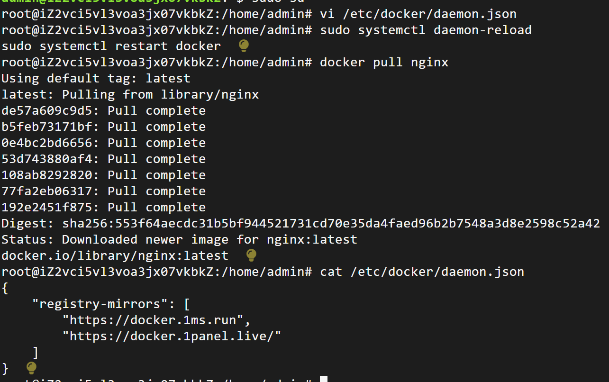
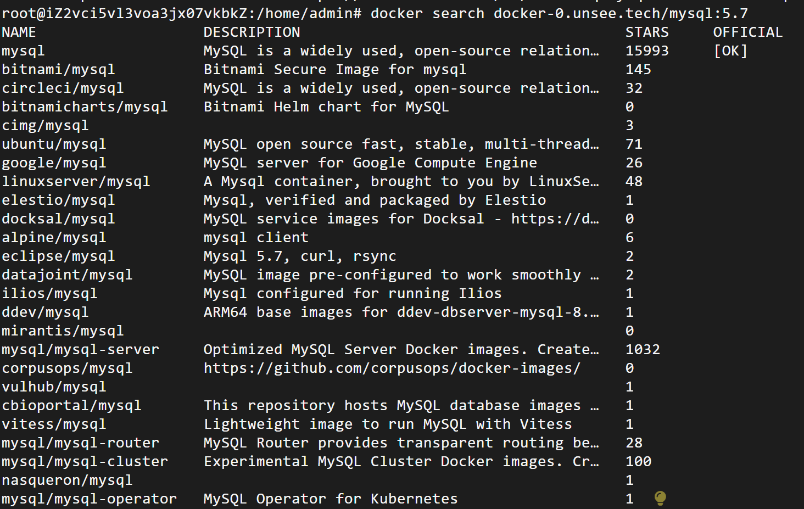

### 镜像拉取不成功的问题

#### 配置镜像源 

编辑/etc/docker/daemon.json，

加入：

```shell
{
    "registry-mirrors": [
        "https://dockerproxy.com",
        "https://docker.m.daocloud.io",
        "https://cr.console.aliyun.com",
        "https://ccr.ccs.tencentyun.com",
        "https://hub-mirror.c.163.com",
        "https://mirror.baidubce.com",
        "https://docker.nju.edu.cn",
        "https://docker.mirrors.sjtug.sjtu.edu.cn",
        "https://github.com/ustclug/mirrorrequest",
        "https://registry.docker-cn.com"
    ]
}
```

也可以选择自己的镜像加速地址。

或者加入：

```shell
{
  "registry-mirrors": [
    "https://docker.1ms.run",
    "https://docker.1panel.live/"
  ]
}
```

经测试，这个有用：



#### 国内各大云服务商提供的镜像加速服务

下面给出几大云服务商的镜像服务地址：

腾讯云容器镜像服务 (TCR) ：https://cloud.tencent.com/document/product/1141/50332

华为云容器镜像服务(SWR)：https://support.huaweicloud.com/swr/index.html

阿里云容器镜像服务(ACR)：https://help.aliyun.com/document_detail/60750.html

补充：重启docker服务命令：

```shell
sudo systemctl daemon-reload 
sudo systemctl restart docker
```

#### docker search网络超时的问题

我们会发现，哪怕修改了daemon文件里的镜像源，可以成功拉取镜像，在使用docker search 时依然出现网络超时的问题，这是因为配置国内镜像源可以加快 docker pull拉取镜像的速度。

但是，配置国内镜像源是对 docker search 没有用的，**因为这个命令使用的仍然是 docker 默认搜索地址，在国内就会造成超时**。

这种问题的解决办法是在使用该命令时加上指定源的域名：

这里使用的是 docker-0.unsee.tech，它是一个提供 Docker Hub 镜像加速服务的网站

```shell
docker search docker-0.unsee.tech/mysql:5.7
```


