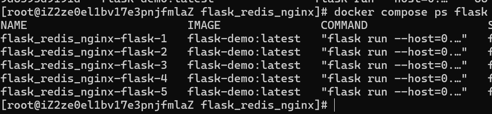
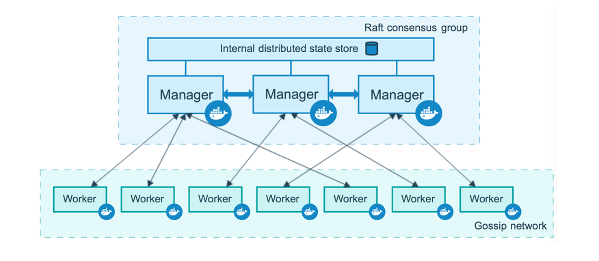

# docker compose 与 swarm集群

# docker compose

# 概述

在生产环境中，一个完整项目势必用到多个容器配合完成项目中业务开发，一旦引入多个容器，容器之间就会形成某种依赖，也就意味某个容器或某些容器的运行需要其他容器优先启动之后才能正常运行。这个时候如果还用命令的方式去起每个容器，那么就会变得特别繁琐，后续也不易维护；

这些问题被称为容器编排问题；docker compose就比较好的解决了这个问题；

docker-compose为docker官方的开源项目，目的是实现对容器或集群（swarm）的快速编排；

Compose 项目由 Python 编写，实现上调用了 Docker 服务提供的 API 来对容器进行管理。

# 几个重要的概念

快速编排：站在项目角度将一组相关联容器整合在一起，对这组容器按照指定顺序进行启动。

服务(service): 一个应用的容器, 实际上可以包括若干运行相同镜像的容器实例。

模版文件：起容器时就是根据模版文件来启动的；模版文件为yaml格式，所以需要遵循yaml格式的语法；然后默认是以docker-compose.yaml来命令的，如果是以其他名称来命令文件的，使用docker-compose 命令时，需要使用-f 参数指定文件名。

# docker compose的安装与卸载

因为linux上下载好docker之后，默认是没有安装docker compose的，需要我们自己安装


# 安装步骤：

```shell
# 下载docker-compose二进制文件
sudo curl -L "https://get.daocloud.io/docker/compose/releases/download/1.27.4/docker-compose-$(uname -s)-$(uname -m)" -o /usr/local/bin/docker-compose

# 赋予可执行权限
sudo chmod +x /usr/local/bin/docker-compose

# 查看版本
docker-compose -v

```

或：

```shell
 #下载docker-compose  
 wget https://github.com/docker/compose/releases/download/v2.16.0/docker-compose-linux-x86_64  
 #移动到可执行的路径  
 mv docker-compose-linux-x86_64 /usr/local/bin/docker-compose  
 #赋予执行权限  
 chmod +x /usr/local/bin/docker-compose  
 #查看版本  
 docker-compose --version  
 #删除docker-compose  
 rm -f /usr/local/bin/docker-compose
```

都不行可以参考 [下载](https://blog.csdn.net/m0_73866100/article/details/146464094?fromshare=blogdetail&sharetype=blogdetail&sharerId=146464094&sharerefer=PC&sharesource=RemSiesta&sharefrom=from_link)


# 卸载

```yaml
 rm /usr/local/bin/docker-compose
```

# yaml文件格式

由于docker-compose文件是使用yaml格式来编写的；在学习compose之前，先了解一下yaml的语法：YAML是一个类似XML、JSON的标记性语言。它强调以数据为中心，并不是以标识语言为重点。因而YAML本身的定义比较简单，号称"一种人性化的数据格式语言"。

```yaml
services:   
  nginx: 
    image:nginx: alpine   
      container_name: my/nginx   
      ports: 
        -80:80   
      networks: 
        -mybridge   
networks:   
    mybridge:   
    external: true
```

YAML的语法比较简单，主要有下面几个：

- 大小写敏感  
- 使用缩进表示层级关系  
- 缩进不允许使用tab，只允许空格(低版本限制)  
- 缩进的空格数不重要，只要相同层级的元素左对齐即可  
- '#'表示注释

YAML支持以下几种数据类型：

- 纯量：单个的、不可再分的值  
- 对象：键值对的集合，又称为映射（mapping）/哈希（hash）/字典（dictionary）  
- 数组：一组按次序排列的值，又称为序列（sequence）/列表(list)
```yaml
 # 纯量，就是指的一个简单的值，字符串、布尔值、整数、浮点数、Nu11、时间、日期  
 #1布尔类型  
 c1: true (或者True)  
 #2 整型
```
```yaml
 c2: 234  
 # 3 浮点型  
 c3: 3.14  
 # 4 null类型  
 c4: ~ # 使用~表示null  
 # 5 日期类型  
 c5: 2018-02-17 # 日期必须使用ISO 8601格式，即yyyy-MM-dd  
 # 6 时间类型  
 c6: 2018-02-17T15:02:31+08:00 # 时间使用ISO 8601格式，时间和日期之间使用T连接，最后使用+代表时区  
 # 7 字符串类型  
 c7: heima # 简单写法，直接写值，如果字符串中间有特殊字符，必须使用双引号或者单引号包裹  
 c8: line1  
 line2 # 字符串过多的情况可以拆成多行，每一行会被转化成一个空格
```

```yaml
 #对象  
 #形式一（推荐）：  
 heima:  
    age:15  
    address:Beijing  
 #形式二（了解）：  
 heima:{age:15,address:Beijing}
```

```yaml
 #数组  
 #形式一（推荐）：  
 address:  
    -顺义  
    -昌平  
 #形式二（了解）：  
 address：[顺义，昌平]
```

# 小提示：

1 书写yam!切记: 后面要加一个空格  
2 如果需要将多段yaml配置放在一个文件中，中间要使用---分隔  
3 下面是一个yaml转json的网站，可以通过它验证yaml是否书写正确

https://www.json2yaml.com/convert-yaml-to-JSON

# docker compose常用命令清单


| docker compose 命令 | 说明 | 常见参数说明 |
|-------------------|------|-------------|
| docker compose stop | 停止容器 |
| docker compose start | 启动容器 |
| docker compose rm | 删除容器 |
| docker compose restart | 重启容器 |
| docker compose run | 运行一个临时容器 |
| docker compose ps | 查看容器状态 |
| docker compose up | 启动容器 | -d 后台运行容器 |
| docker compose down | 停止容器 | -v 删除容器和卷 |
| docker compose logs | 查看容器日志 | -f 跟随日志输出 |
| docker compose exec | 进入容器 | -tt 启动交互式终端 |
| docker compose pull | 拉取镜像 |  |
| docker compose build | 构建镜像 |  |
| docker compose images | 列出镜像 |  |
| docker compose push | 推送镜像 |  |
| docker compose config | 显示配置信息 |  |
| docker compose version | 查看版本信息 |  |

# 模版文件基本结构

模板文件是使用DockerCompose的核心，涉及到的指令关键字也比较多。默认的模板文件名称为docker-compose.yml，格式为YAML格式。常见的关键字如下：

```yaml
services: # 容器

  servicename1: # 服务名字，这个名字也是内部bridge网络可以使用的DNS name
    image: # 镜像的名字
    command: # 可选，如果设置，则会覆盖默认镜像里的CMD命令
    environment: # 可选，相当于docker run里的--env
    volumes: # 可选，相当于docker run里的-v
    networks: # 可选，相当于docker run里的--network
    ports: # 可选，相当于docker run里的-p

  servicename2:

volumes: # 可选，相当于docker volume create
networks: # 可选，相当于docker network create
```

# build指令

指定Dockerfile所在文件夹的路径（可以是绝对路径，或者相对docker-compose.yml文件的路径）。  
Compose 将会利用它自动构建这个镜像，然后使用这个镜像。

```yaml
services:
  web:
    build: . #指定Dockerfile的上下文目录为当前目录  
```

你也可以使用context指令指定Dockerfile所在文件夹的路径。

使用 dockerfile 指令指定 Dockerfile 文件名。

使用arg指令指定构建镜像时的变量。

```yaml
services:
  webapp:
    build:
      context: /dir  # Dockerfile的上下文目录为当前目录的dir目录下
      dockerfile: Dockerfile-alternate
      args:
        buildno: 1
```

# command指令

覆盖容器启动后默认执行的命令，类似于docker run image 命令

以下面的Dockerfile文件为例，容器启动后执行的是java -jar apps.jar

```dockerfile
 FROM openjdk:8-jre
 EXPOSE 8081
 ENV APP_PATH=/apps
 WORKDIR $APP_PATH
 COPY apps.jar $APP_PATH
 ENTRYPOINT ["java","--jar"]
 CMD ["apps.jar"]
```

如果我们想要容器启动后执行的是java -jar test.jar，在docker-compose.yml文件中使用指令command: ["test.jar"]

```yaml
services:
  webapp:
    build:
      context: /dir  # Dockerfile的上下文目录为当前目录的dir目录下
      dockerfile: Dockerfile-alternate
      args:
        buildno: 1
    command: ["java", "-jar", "test.jar"]
```

container_name 指令（不推荐使用）

指定容器名称。默认将会使用项目名称服务名称序号这样的格式。

```yaml
container_name: docker-web-container
```

注意: 指定容器名称后, 该服务将无法进行扩展 (scale), 因为 Docker 不允许多个容器具有相同的名称。

depends_on指令

解决容器的依赖、启动先后的问题。以下例子中会先启动redis、db再启动web:

```yaml
services:
  web:
    build: .
    depends_on:  # web服务依赖于db和redis服务
      - db
      - redis
  redis:
    image: redis
  db:
    image: postgres
```

注意：在启动web服务时，并不会等待redis、db服务进入ready状态，而只是等到它们被启动状态(running状态)了。

environment指令

设置环境变量，相当于 docker run -e。你可以使用数组或字典两种格式。

只给定名称的变量会自动获取运行Compose主机上对应变量的值，可以用来防止泄露不必要的数据。

```yaml  
services:   
  mysql: 
    image: mysql:5.7   
  ports: 
    - "3306:3306"   
  environment: 
    MySQL_ROOT_PASSWORD: root #字典格式
```

# env_file 指令

从文件中获取环境变量，可以为单独的文件路径或列表。

如果通过 docker-compose -f FILE 方式来指定Compose模板文件，则env_file中变量的路径会基于模板文件路径。

如果有变量名称与 environment 指令冲突，则按照惯例，以 environment 为准。

```yaml
env_file: .env  

env_file: #指定多个环境变量文件  
  - ./common.env  
  - ./env  
  - /opt/secrets.env
```

环境变量文件中每一行必须符合格式，支持#开头的注释行。

环境变量文件 .env: 推荐使用这种命名，因为在Linux下，这种方式命名的文件属于隐藏文件，一定程度上防止泄露不必要的数据。

```txt
1 MySQL_ROOT_PASSWORD=root
```

# expose 指令

用来指定镜像构建过程中容器暴露的端口号，但不映射到宿主机，只被连接的服务访问。

该指令compose配置文件中一般不用，都在Dockerfile文件中使用EXPOSE指定。

# image指令

指定为镜像名称或镜像 ID。如果镜像在本地不存在，Compose 将会尝试拉取这个镜像，相当于 docker run image（镜像名）。

# networks指令

指定启动容器时使用的网络，相当于 docker run --network

```yaml
services:
  some-service:
    networks:
      - some-network  # 指定使用的网络
      - other-network

networks:  # 创建网络
  some-network:
  other-network:
```

ports指令

指定宿主机和容器端口映射，或者仅仅指定容器的端口（宿主将会随机选择端口）都可以。

注意：当使用 HOST:CONTAINER 格式来映射端口时，如果你使用的容器端口小于 60 并且没放到引号里，可能会得到错误结果，因为 YAML会自动解析xx:yy这种数字格式为 60 进制。为避免出现这种问题，建议数字串都采用引号包括起来的字符串格式。

volumes指令

用来指定宿主机目录和容器目录映射

```yaml
services:
  my_src:
    image: mysql:8.0
    volumes:  # 数据卷名称挂载
      - mysql_data:/var/lib/mysql

volumes:  # 定义数据卷名称
  mysql_data:
```

restart指令

指定容器退出后的重启策略为始终重启。该命令对保持服务始终运行十分有效。
```yaml
restart: always
```
# 实战练习1

WordPress是使用PHP语言开发的开源博客平台。

部署wordpress + mysql;

docker-compose.yaml:

```yaml
services:
  db:
    image: mysql:8.0
    command: --default-authentication-plugin=mysql_native_password --character-set-server=utf8mb4 --collation-server=utf8mb4_unicode_ci
    volumes:
      - db_data:/var/lib/mysql
    restart: always
    environment:
      MYSQL_ROOT_PASSWORD: somewordpress
      MYSQL_DATABASE: wordpress
      MYSQL_USER: wordpress
      MYSQL_PASSWORD: wordpress
    networks:
      - wordpress

  wordpress:
    depends_on:
      - db
    image: wordpress:latest
    ports:
      - "8000:80"
    restart: always
    environment:
      WORDPRESS_DB_HOST: db:3306
      WORDPRESS_DB_USER: wordpress
      WORDPRESS_DB_PASSWORD: wordpress
      WORDPRESS_DB_NAME: wordpress
    networks:
      - wordpress

volumes:
  db_data:

networks:
  wordpress:
    external: true
```

```shell
docker compose up -d
docker compose ls
docker compose ps
```

# 实战练习2

Python Flask + Redis练习:

目录结构：
``` text
/flask_redis/  
├── docker-compose.yaml          # ← 在这里  
└── flask/  
    ├── Dockerfile  
    └── app.py
```
docker-compose.yaml:  
```yaml
services:
  flask:
    build:
      context: ./flask
      dockerfile: Dockerfile
    image: flask-demo:latest
    networks:
      - mybridge
    environment:
      - REDIS_HOST=redis-server
    ports:
      - "5000:5000"

  redis-server:
    image: redis:latest
    networks:
      - mybridge

networks:
  mybridge:  # 自动创建网络
```
app.py:  
```python
from flask import Flask
from redis import Redis
import os
import socket

app = Flask(__name__)
redis = Redis(host=os.environ.get('REDIS_HOST', '127.0.0.1'), port=6379)

@app.route('/')
def hello():
    redis.incr('hits')
    return f"Hello Container world! I have been seen {redis.get('hits').decode('utf-8')} times and my hostname is {socket.gethostname()}.\n"

@app.route('/hello')
def hello_world():
    return "hello world .\n"

@app.route('/test')
def test():
    return "I am test .\n"

if __name__ == '__main__':
    app.run(host='0.0.0.0', port=5000, debug=True)
```

dockerfile:  
```dockerfile
FROM python:3.9.5-slim

RUN pip install flask redis && \
    groupadd -r flask && useradd -r -g flask flask && \
    mkdir /src && chown -R flask:flask /src

USER flask
COPY --chown=flask:flask app.py /src/app.py
WORKDIR /src
ENV FLASK_APP=app.py
EXPOSE 5000
CMD ["flask", "run", "--host=0.0.0.0"]
```

服务更新常用命令：  
```shell
# 预先构建所需镜像  
docker-compose build  
# 预先拉取所需镜像  
docker-compose pull  
# 启动容器  
docker-compose up -d
# 更新镜像时，使用  
docker-compose up -d --build  
#重启容器  
docker-compose restart  
# 删除无用的service  
docker-compose up -d --remove-orphans
```
# docker 网络理解

如果docker-compose.yml中没有定义network，默认情况下，在docker-compose up -d后，会创建一个bridge类型的network，将相关容器都会绑定在该网络下。

并且，Docker 自带了一个内部 DNS 服务器，它会自动处理同一网络内容器的名称解析。当容器连接到同一个自定义的网络时，它们可以通过容器名字互相访问，因为 Docker 的 DNS 服务会解析这些容器名字到其 IP 地址。甚至，容器之间还可以通过docker-compose中，定义的service的名字相互ping通（可利用其实现负载均衡）。

具体编写可查看官方文档https://docs.docker.com/compose/compose-file/06-networks/（注意，需要科学上网）

# 实现水平拓展与负载均衡

当想要将docker-compose中定义的同一个service，水平扩展时：

可以使用scale参数
```shell
# servicename为定义的name,n为目标个数  
docker-compose up -d --scale servicename=n
```
水平扩展后，当通过servicename+端口访问服务时，docker会自动实现一个简单的负载均衡机制。

# 实战练习3

在上述的练习2上再加一个nginx容器，来实现负载均衡

目录结构：

```txt
/flask_redis/  
├── default.conf
├── docker-compose.yaml          # ← 在这里  
└── flask/  
    ├── Dockerfile  
    └── app.py

```

只需要稍微更改一下compose文件以及加一个nginx的配置文件：

docker-compose.yaml:

```yaml

services:
  flask:
    build:
      context: ./flask
      dockerfile: Dockerfile
    image: flask-demo:latest  
    networks:
      - mybridge
    environment:
      - REDIS_HOST=redis-server

  redis-server:
    image: redis:latest
    networks:
      - mybridge

  # 通过nginx实现负载均衡
  nginx:
    image: nginx:stable-alpine3.20-otel
    networks:
      - mybridge
    volumes:
      # 需要根据default.conf文件实际目录来配置
      - /root/course_show/flask_redis_nginx/default.conf:/etc/nginx/conf.d/default.conf
    ports:
      - "5000:80"
    depends_on:
      - flask

networks:
  mybridge:
```
default.conf:

```nginx
server {
listen  80 default_server;
  location / {
    proxy_pass http://flask:5000;
  }
}
```

```shell
# 启动服务  
docker-compose up -d  
docker-compose ps flask  
# 多个实例
docker-compose up -d --scale flask=5  

# 需要重启才能生效  
docker-compose restart
```





# docker swarm是什么

Docker Swarm 是 Docker 的集群管理工具。其主要作用是把若干台 Docker 主机抽象为一个整体，并且通过一个入口统一管理这些 Docker 主机上的各种 Docker 资源。Docker Swarm 将一个或多个 Docker 节点组织起来，使得用户能够以集群方式管理它们。

# docker swarm组成部分

Swarm 集群由管理节点（Manager）和工作节点（Worker）构成。  
- 管理节点：主要负责整个集群的管理工作，包括集群配置、服务管理等所有跟集群有关的工作。诸如监控集群状态、分发任务至工作节点等操作。  
  
- 工作节点：主要负责执行运行服务的任务。  
  



# 搭建 dockers swarm集群
```shell
docker swarm init --advertise-addr=ip  
# --advertise-addr指定广播地址。即用来与其他节点通信的IP，默认端口为2377.如果主机上有多个网卡，需要指定。
```
# 在leader上查看token
```shell
docker swarm join-token manager  
docker swarm join-token worker
```
# 加入集群成为manager/worker  

```shell
docker swarm join --token SWMTKN-1- 3edcx30eosroclc3hi4jmay8ngfqplf573jfsj6zf9a663axmx-9kngyj7dxaov080ns17ymmpog 192.168.201.145:2377  
 
# 如果主机有多个网卡，则还是需要指定广播地址  
docker swarm join --advertise-addr=IP  
--token SWMTKN-1-3edcx30eosroclc3hi4jmay8ngfqplf573jfsj6zf9a663axmx-9kngyj7dxaov080ns17ymmpog \  
192.168.201.145:2377
```  

```shell
# 查看各个节点  
docker node ls
```

# 集群的解散

分为两步操作，首先在想要退出的节点上离开集群，然后在manager节点上删除退出节点的信息（不删除，则无法再次加入）。  

```shell
# 系歿但退出集群，manager节点退出时，需要加--force  
docker swarm leave [--force]  
  
#退出后需在manager节点删除退出的节点  
docker node rm 退出节点的主机名
```  

# 节点管理

## 查看集群节点
```shell
docker node 1s
```
## 节点升级和降级
```shell
# 升级为manager  
docker node promote 主机名  
# 降级为worker  
docker node demote 主机名  
```  

## 节点下线

节点暂停接受任务
```shell
docker node update --availability drain 主机名
```
## 节点上线

节点重新接受任务
```shell
docker node update --availability active 主机名
```
# 服务管理

注意：节点管理命令均在管理节点上操作，工作节点无操作权限

**解释**


## 容器的创建：
```shell
docker service create [-d --name ...]
```
## 水平扩展/弹性伸缩

即如何更改副本的数量

```shell
#方式一  
docker service scale servicename=数量   
#方式二  
docker service update --replicas 新副本数 服务名
```
## 滚动更新

滚动更新即在不停止服务的情况下更新服务，也成为灰度更新。
```shell
docker service update --image 基础镜像 --update-delay 时间间隔 --update- parallelism 定义并行更新的最大数量 服务名
```
## Visualizer可视化工具

Visualizer非常直观地显示了Swarm集群中，服务器的状态和服务器上面运行容器的状态。

# 在docker swarm中运行  

```shell
docker service create \
  --name=viz \
  --publish=80:8080 \
  --constraint=node.role==manager \
  --mount=type=bind,source=/var/run/docker.sock,destination=/var/run/docker.sock \
  dockersamples/visualizer:latest
```
## 删除服务

```shell
docker service rm service_name
```
# docker stack 部署

swarm堆栈的管理工具，可以解和docker-compose 实现多service应用程序的部署。

详细请看：https://docs.docker.com/compose/compose-file/deploy/#attributes

## docker-compose.yml中有关swarm集群的属性  

```yaml
services:
  my_service:
    deploy:
      replicas: 2
      mode: replicated  # 默认值，也可以是 global
      placement:
        constraints:
          - "node.id==nodeid"           # 根据节点id
          - "node.hostname==hostname"   # 根据节点主机名
      restart_policy:                   # 指定服务部署的重启策略
        condition: on-failure           # none不重启，on-failure为容器故障时重启
        delay: 10s                      # 尝试重启的时间间隔（默认5s）
        max_attempts: 3                 # 最多的尝试次数（默认无限制）
```  

# deploy 字段的主要配置

## replicas

定义服务副本的数量。这个配置项是 Swarm 模式下的关键，用来指定运行服务的实例数量。

```yaml
deploy: 2 
  replicas:3
```

这将创建3个服务副本，确保服务具有高可用性。

## resources

配置服务的资源限制和请求。可以设置内存和CPU配额。分为limits和reservations：

- limits：设置服务可使用的最大资源量。  
- reservations：设置服务需要的最低资源量。

示例：

```yaml
deploy:
  resources:
    limits:
      cpus: "0.5"
      memory: 50M
    reservations:
      cpus: "0.25"
      memory: 20M
```

## placement

定义服务容器部署的位置和约束条件。可以基于节点的标签、节点的属性或者环境变量来限制服务容器的部署位置。

示例：

```yaml
deploy:
  placement:
    constraints:
      - "node.role==manager"
```

这表示该服务只能在 Swarm 集群的 manager 节点上运行。

## update_config

配置服务的更新策略。可以定义如何滚动更新服务，以及每次更新的最大时间间隔、最大失败容器数等。包括：

- parallelism：并行更新的服务实例数量。  
- delay：更新之间的延迟时间。  
- failure_action：在更新失败时采取的操作（如rollback）。  
- monitor：指定多长时间内监控服务状态。

示例：

```yaml
deploy:   
  update_config:   
    parallelism: 2   
    delay: 10s   
    failure_action: rollback   
    monitor: 30s
```

## rollback_config

配置回滚策略。类似于update_config，但用于定义如果更新失败时如何回滚。

示例：

```yaml
deploy:   
  rollback_config:   
    parallelism: 1   
    delay: 5s
```

## max_re replicas_per_node

限制每个节点上运行的最大副本数，避免某些节点过载。

示例：

```yaml
deploy:
  max_replicas_per_node: 3
```

## labels

为服务设置元数据标签，用于组织和筛选。通常用于与其他管理工具进行集成。

示例：

```yaml
deploy:   
  labels:   
    - "com.example.description=My service"   
    - "com.example.department=IT"
```

## restart_policy

配置服务的重启策略。通常有三种策略：none、on-failure 和 any。它决定了服务容器在故障后是否会自动重启。

- condition：重启条件，通常为 none（不重启）、on-failure（故障时重启）、any（无论何时都重启）。  
- delay：重启之间的延迟时间。  
- max Attempts：最大重启次数。  
- window：在多长时间内判断重启失败。

示例：

```yaml
deploy:
  restart_policy:
    condition: on-failure
    delay: 10s
    max_attempts: 5
    window: 30s
```

## init

启用或禁用服务容器的初始化行为。初始化进程是在主进程启动之前运行的过程，用于设置和准备服务。设置为 true 时，Docker 会尝试在容器启动时进行初始化。

示例：

```yaml
deploy: 
  init: true
```

## networks

配置服务与其他服务的网络连接。在 Swarm 中，网络可以是独立的。你可以在 deploy 部分定义服务应该连接到哪些网络。

示例：

```yaml
deploy:   
  networks:   
    -my_network
```

# docker stack常用命令

```shell
docker stack deploy -c "yaml文件" stack_name
docker stack ls
docker stack ps stack_name
docker stack rm stack_name
```

# config

**docker config** 主要用于创建、管理和分发配置数据到Swarm集群中的服务，因为如果使用集群部署服务后，就不能使用本地挂载卷去挂载配置文件到容器了，这时config就登场了。config 和 secret 是为管理配置数据和敏感信息而设计的，它们具有特定的机制来确保**跨集群节点的访问和一致性**。（集群中实现持久化和管理数据，必须使用共享存储或者分布式存储和云存储）

- 创建配置：

```shell
docker config create my_config ./my_config_file
```

这个命令会创建一个新的配置项 my_config，并将 ./my_config_file 中的内容作为配置数据。

查看配置：

```shell
docker config inspect my_config
```

这个命令会显示配置项 my_config 的详细信息。

列出所有配置：

```shell
docker config ls
```

这个命令会列出所有的配置项。

- 删除配置：

```shell
docker config rm my_config
```

这个命令会删除配置项 my_config。

# secret

Docker Secrets 用于在Docker Swarm中安全地管理敏感数据。使用步骤如下:

# 1. 创建秘密：

```shell
echo "my_secret_value" | docker secret create my_secret -
```

或从文件中创建：

```shell
docker secret create my_secret /path/to/secret/file
```

# 2. 列出秘密：

```shell
docker secret ls
```

# 3. 查看秘密：

```shell
docker secret inspect my_secret
```

4. 将秘密挂载到服务中：在DockerCompose文件中配置服务使用秘密：

```yaml
services:
  my_service:
    image: my_image
    secrets:
      - my_secret

secrets:
  my_secret:
    external: true
```

或通过命令行创建服务并挂载秘密：

```shell
docker service create --name my_service --secret my_secret my_image
```

# 5. 删除秘密：

```shell
docker secret rm my_secret
```

秘密在容器中会被挂载到 /run/secrets/ 目录下。


# 实战练习4--部署mysql+wordpres

```yaml
services:
  db:
    image: mysql:latest
    restart: always
    environment:
      MYSQL_ROOT_PASSWORD: root
      MYSQL_DATABASE: wordpress      
      MYSQL_USER: siesta
      MYSQL_PASSWORD: 123456
    volumes:
      - db_data:/var/lib/mysql

    networks:
      - wp_network

  wordpress:                       
    image: wordpress:latest
    restart: always
    environment:
      WORDPRESS_DB_HOST: db:3306
      WORDPRESS_DB_NAME: wordpress
      WORDPRESS_DB_USER: siesta
      WORDPRESS_DB_PASSWORD: 123456
    volumes:
      - wordpress_data:/var/www/html
    networks:
      - wp_network
    deploy:                        
      replicas: 3
      mode: replicated

  nginx:                             
    image: nginx:alpine
    restart: always
    ports:
      - "80:80"                     
    volumes:
     # 这里需要修改为你自己的文件路径
      - /root/docker_swarm_try/default.conf:/etc/nginx/conf.d/default.conf
    networks:
      - wp_network
    deploy:
      placement:
        constraints:
          - "node.role == manager"  # nginx在主节点运行

volumes:                            
  db_data:
  wordpress_data:

networks:                            
  wp_network:

```

# 作业：

level0

了解课上讲的内容，理解docker compose 和docker swarm的应用场景和为什么需要这种技术，把环境给配好，比如下载好docker compose ，初始化一个swarm集群。

level1

使用docker compose部署一个项目(可以是网上找的，自己写的，也可以是课上的实践)。

level2

使用swarm集群部署一个服务(这里可以试试在虚拟机上面实现，毕竟集群的多节点还是太贵了，如果购买服务器的话。然后部署的项目也可以是任何的地方来的)。

level3

在level2 和level3 的基础上，按你的想法来修改服务，可以是多个副本实现负载均衡等，把你理解到的输出出来。

level4  

如果你已经掌握了以上的部署，你可以继续了解kubernetes(k8s)部署，这也是一个解决容器编排的强大技术，学有余力试着使用k8s来部署。

课后小话:作业需要提交配置文件(compose和其他的如ginx的)，如果是公网部署的也可以把你的访问地址发给我，这一节开始的内容可能会有一些难，大家学习的话可以从"为什么","解决了什么问题","怎么解决的问题"这些角度来理解加深学习，课下不懂也可以多问我们，重在坚持。

作业发送邮箱： **tantao@lanshan.email**