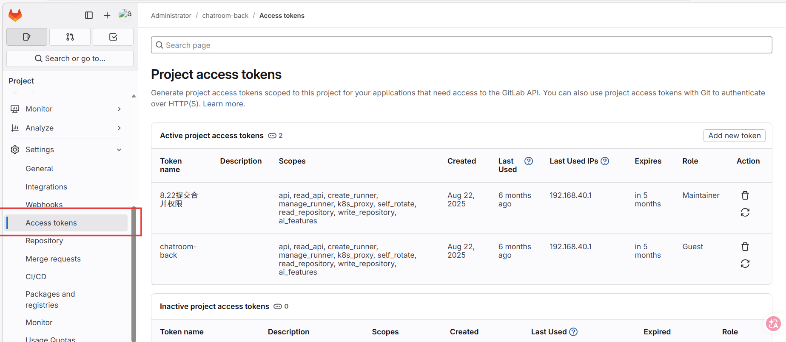
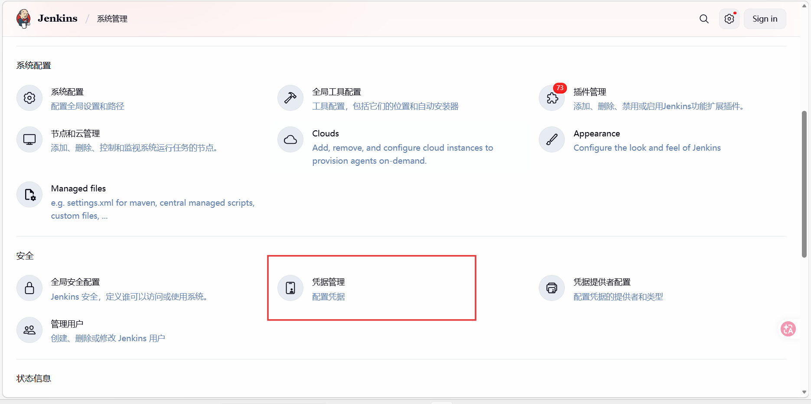
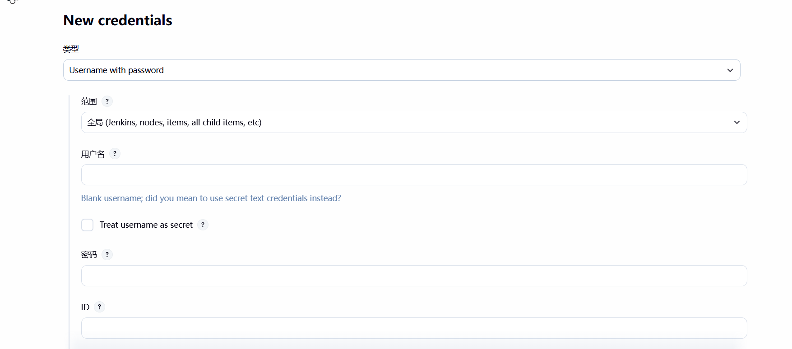
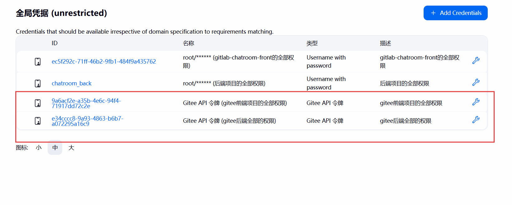
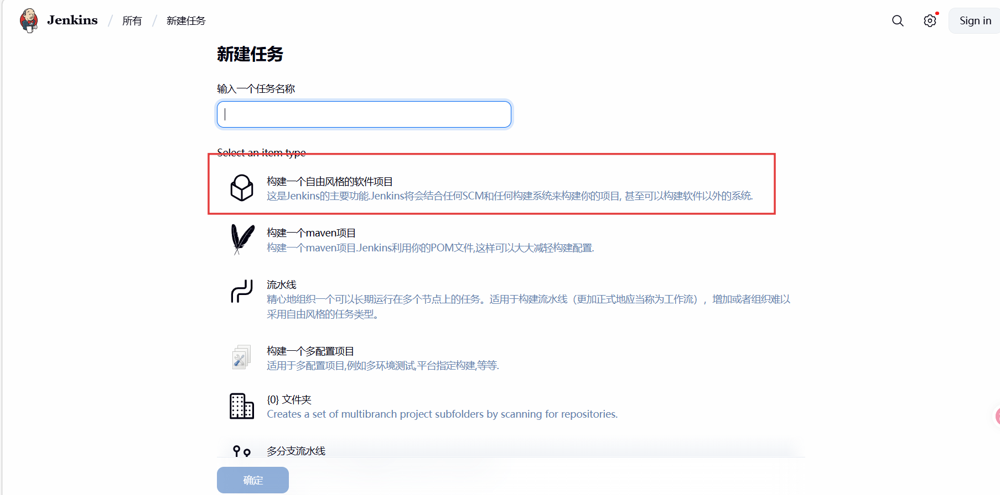
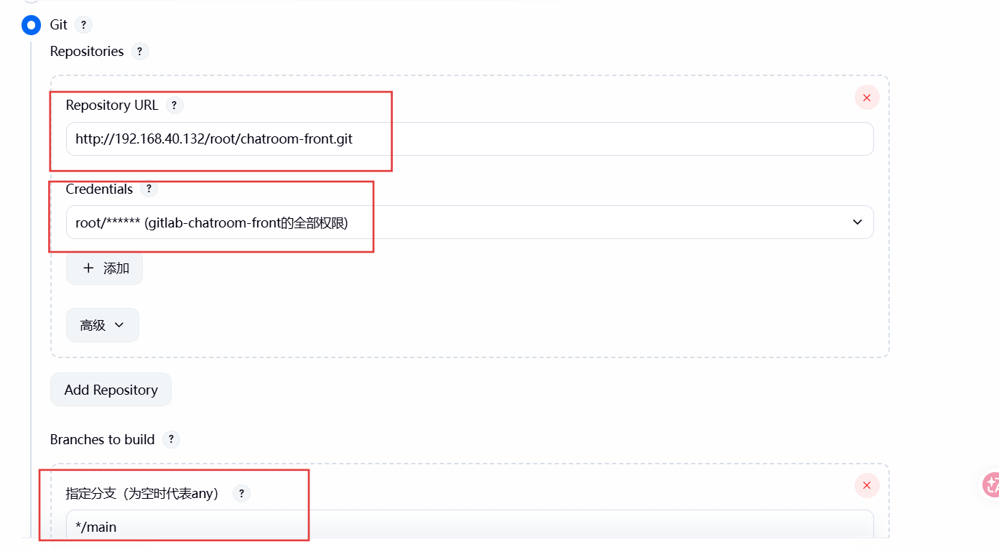
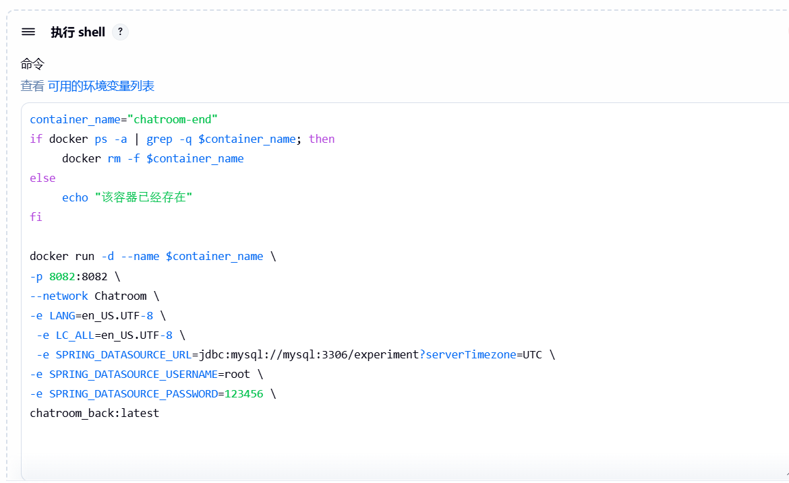
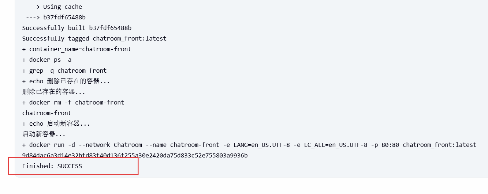

# CICD：世界本应如此

CICD学习可参考资料：

[CICD（一）CI/CD概述及GitLab部署和一些Git命令 - 详解 - gccbuaa - 博客园](https://www.cnblogs.com/gccbuaa/p/19289480#2_CICD_51)

### 一、CICD概述

CI/CD 是一种通过在应用开发阶段引入**自动化**来频繁向客户交付应用的方法。CI/CD 的核心概念是持续集成、持续交付、持续部署。它是作为一个面向开发和运营团队的解决方案，主要针对在集成新代码时所引发的问题（也称为：“集成地狱”）。CI/CD 可让持续自动化和持续监控贯穿于应用的整个生命周期（从集成和测试阶段，到交付和部署）。这些关联的事务通常被统称为 **CI/CD 管道**，由开发和运维团队以敏捷方式协同支持。

### 二、 为什么要使用CICD

+ **减少人工错误**：传统手动部署依赖人工操作，易因疏忽导致配置错误或步骤遗漏，CICD通过自动化消除人为干预。

+ **加速开发迭代**：频繁集成代码可及早发现问题，避免开发后期出现难以解决的冲突；自动化部署缩短从开发到上线的周期。

+ **提高代码质量**：每次提交自动触发测试，确保代码符合质量标准，减少生产环境bug。

+ **增强团队协作**：强制团队成员频繁同步代码，促进协作，避免“孤岛开发”导致的整合难题。

### 三、 CICD的作用

- **自动化流程**：将代码提交、构建、测试、部署等环节自动化，减少重复劳动。

- **快速反馈**：代码提交后立即反馈构建或测试结果，帮助开发者快速定位问题。

- **风险控制**：通过自动化测试和分阶段部署（如先部署到测试环境），降低直接发布到生产环境的风险。

- **一致性保障**：确保开发、测试、生产环境的配置和流程一致，避免“在我电脑上能运行”的问题。

### 四、 CICD的三大使用场景

在传统环境、容器环境和K8s环境中，CICD的核心目标（自动化集成、测试、部署）一致，但实现方式、工具链和复杂度存在显著差异，主要体现在环境一致性、部署效率和扩展性上。

+ **传统环境**：依赖手动配置，CICD聚焦“脚本自动化”，适合简单场景。

+ **容器环境**：以镜像为核心，解决环境一致性，CICD聚焦“镜像生命周期管理”，适合中小规模应用。

+ **K8s环境**：基于容器和编排平台，CICD与K8s深度集成，支持声明式部署和大规模集群，适合复杂微服务架构。
  随着系统复杂度提升，CICD从“工具链拼接”向“平台化、云原生”演进，核心驱动力是降低环境差异、提升部署效率和可靠性。

### 五、容器环境的CICD

容器环境（如Docker）通过镜像封装应用及依赖，解决了传统环境的“环境一致性”问题，CICD流程更聚焦于镜像生命周期管理：

+ **特点**：
  + 环境标准化：应用及其依赖（如Python版本、库文件）被打包成镜像，确保开发到生产环境一致（“一次构建，到处运行”）。
  + 部署轻量化工：部署流程简化为“拉取镜像→启动容器”，可通过脚本或工具自动化。
  + 镜像为核心：CICD流程新增“构建镜像”“推送镜像到仓库（如Docker Hub、Harbor）”环节。

+ **流程实例**：
  + 开发者提交代码到Git仓库；
  + Jenkins触发自动构建：编译代码→运行测试→通过Dockerfile构建镜像；
  + 镜像推送到私有仓库；
  + 部署脚本从仓库拉取镜像，在目标服务器上启动容器

### 六、CICD实战

#### 1、部署jenkins

```shell
docker pull jenkins/jenkins:jdk21  或者 docker pull jenkins/jenkins:jdk17
mkdir -p /usr/local/jenkins
chmod 755 /usr/local/jenkins
docker run -d \
  --name jenkins_1 \
  -p 8099:8080 -p 50099:50000 \
  -v /usr/local/jenkins:/var/jenkins_home \
  -v /var/run/docker.sock:/var/run/docker.sock \
  -v /usr/bin/docker:/usr/bin/docker \
 jenkins/jenkins:jdk21
```

具体部署可以看以下教程，[CICD流程，vite+react一键自动部署、springboot一键自动部署_哔哩哔哩_bilibili](https://www.bilibili.com/video/BV1VVqnYLEZa/?vd_source=e81cb97597d16e12fed88e4e65b8eab5)

#### 2、配置仓库权限

一般在自己仓库管理下面，选择Access Tokens,然后根据自己的需要，配置对应的可访问权限



接着在jenkins配置好全局凭证



创建新凭证





#### 3、搭建CICD流水线

+ 选择自由风格（可以根据自己的偏好选择）



+ 配置仓库信息，（仓库地址、凭证、分支）

  

+ 配置部署脚本

  

  举个例子，可以做个参考吧

  ```shell
  #前端项目指令
  npm install
  npm run build
  
  # 构建 Docker 镜像
  docker build -t chatroom_front:latest .
  
  # 设置容器名称
  container_name="chatroom-front"
  
  # 检查并清理已存在的容器
  if docker ps -a | grep -q $container_name; then
      echo "删除已存在的容器..."
      docker rm -f $container_name
  fi
  
  # 运行新容器
  echo "启动新容器..."
  docker run -d \
  --network Chatroom
    --name $container_name \
    -e LANG=en_US.UTF-8 \
    -e LC_ALL=en_US.UTF-8 \
    -p 80:80 \
    chatroom_front:latest
  
  ```

  ```shell
  #后端部署指令
  mvn clean package -DskipTests
  docker build -t Chatroom_back:latest .
  container_name="chatroom-end"
  if docker ps -a | grep -q $container_name; then
      docker rm -f $container_name
  else
      echo "该容器已经存在"
  fi
  
  docker run -d --name chatroom-end \
  --network Chatroom \
  -e LANG=en_US.UTF-8 \
   -e LC_ALL=en_US.UTF-8 \
   -e SPRING_DATASOURCE_URL=jdbc:mysql://mysql:3306/experiment?serverTimezone=UTC \
  -e SPRING_DATASOURCE_USERNAME=root \
  -e SPRING_DATASOURCE_PASSWORD=123456 \
  chatroom_back:latest
  
  ```

  

+ 查看日志

  

**CICD成功**

课后作业：

完成一次CICD自动化部署项目，最好是前后端分离，多容器部署。

之前发了一个springboot+vue项目，可以以那个项目为例子做一次CICD。

完成的作业，请以截图的形式提交到lekai@lanshan.email