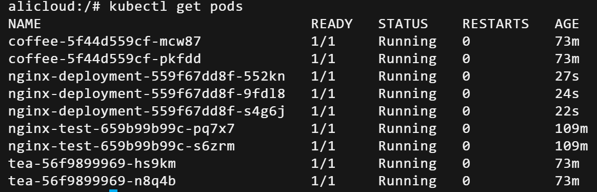
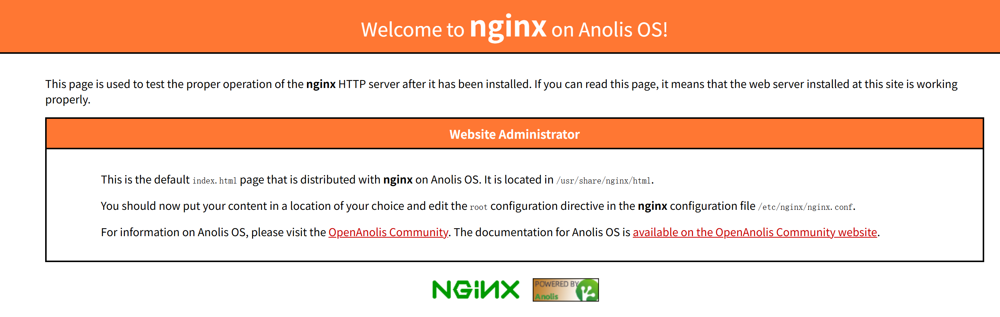

# k8s基础第一课

## 概述

### k8s是什么

k8s的全称是Kubernetes，Kubernetes 是 Google 开源的容器编排系统，2014 年对外宣布，2015 年发布 1.0 版本，同年 Google 与 Linux 基金会一起成立云原生计算基金会（CNCF-Cloud Native Computing Foundation），并把 Kubernetes 作为种子产品捐赠给了 CNCF。


k8s是市场上最好的容器编排工具之一。

我们之前讲容器时说过，容器就是一个包，其中包含了应用及其所有依赖，我们不必记着我们的应用是用什么语言和框架开发的，因为所需的一切都打包在了容器中，例如运行时环境、所需的库等等，可以安全的迁移，可以在任何环境中部署，而Kubernetes 是用于负责在大规模服务器环境中管理容器组（pod）的扩展、复制、健康，并解决 pod 的启动、负载均衡等问题。k8s的一大优势就是，一个平台搞定所有。

使用 Kubernetes，部署任何应用都是小菜一碟，只要应用可以打包进容器，Kubernetes 就一定能启动它。

更重要的是，k8s可以实现云环境无缝迁移。如果你有换云环境的需求，使用 Kubernetes 的话，你就不用有任何担心。

k8s能够高效利用资源，如果发现有节点工作不饱和，便会重新分配 pod，帮助我们节省开销，高效的利用内存、处理器等资源。

如果一个节点宕机了，Kubernetes 会自动重新创建之前运行在此节点上的 pod，在其他节点上运行。k8s的一大优点就是可靠性，应用会一直顺利运行，不会被 pod 或 节点的故障所中断。如果出现故障，Kubernetes 会创建必要数量的应用镜像，并分配到健康的 pod 或节点中，直到系统恢复。

### 核心概念

#### 节点

k8s 集群的节点有两个角色，分别为 Master 节点和 Node 节点

##### Master 节点

Master 节点也称为控制节点，每个 k8s 集群都有一个 Master 节点负责整个集群的管理控制


- API Server：提供了 HTTP Rest 接口的服务进程，所有资源对象的增、删、改、查等操作的唯一入口；
- Controller Manager：k8s 集群所有资源对象的自动化控制中心；
- Scheduler：k8s 集群所有资源对象自动化调度控制中心；
- ETCD：k8s 集群注册服务发现中心，可以保存 k8s 集群中所有资源对象的数据。

##### Node

Node 节点的作用是承接 Master 分配的工作负载，它主要有以下几个关键组件：

- kubelet：负责 Pod 对应容器的创建、启停等操作，与 Master 节点紧密协作；
- kube-porxy：实现 k8s 集群通信与负载均衡的组件。


#### Pod

Pod 是 k8s 最重要而且是最基本的一个资源对象，它是容器的一个上层包装结构，这也就是为什么 K8s 可以支持多种容器类型的原因，基于这方面， k8s 的定位就是一个编排与调度工具，而容器只是它调度的一个资源对象而已。

#### Label

Label 在 k8s 中是一个非常核心的概念，我们可以将 Label 指定到对应的资源对象中，例如 Node、Pod、Service 等，一个资源可以绑定任意个 Label，k8s 通过 Label 可实现多维度的资源分组管理，后续可通过 Label Selector 查询和筛选拥有某些 Label 的资源对象，例如创建一个 Pod，给定一个 Label，workerid=123，后续可通过 workerid=123 删除拥有该标签的 Pod 资源。

#### Replica Set

Replica Set 目的是为了定义一个期望的场景，比如定义某种 Pod 的副本数量在任意时刻都处于 Peplica Set 期望的值

假设 Replica Set 定义 Pod 的副本数目为：replicas=2，当该 Replica Set 提交给 Master 后，Master 会定期巡检该 Pod 在集群中的数目，如果发现该 Pod 挂掉了一个，Master 就会尝试依据 Replica Set 设置的 Pod 模版创建 Pod，以维持 Pod 的数量与 Replica Set 预期的 Pod 数量相同。
通过 Replica Set，k8s 集群实现了用户应用的高可用性，而且大大减少了运维工作量。因此生产环境一般用 Deployment 或者 Replica Set 去控制 Pod 的生命周期和期望值，而不是直接单独创建 Pod。

#### Service

Service 就是我们平时所提及的微服务架构中的“微服务”，本文上面提及的 Pod、Replica Set 等都是为 Service 服务的资源


Service 定义了一个服务访问的入口，客户端通过这个入口即可访问服务背后的应用集群实例，而 Service 则是通过 Label Selector 实现关联与对接的，Replica Set 保证服务集群资源始终处于期望值。

#### Namespace

Namespace 顾名思义是命名空间的意思，在 k8s 中主要用于实现资源隔离的目的

用户可根据不同项目创建不同的 Namespace，通过 k8s 将资源分配到不同 Namespace 中，即可实现不同项目的资源隔离


## 组件介绍

### k8s的控制组件

#### 控制平面

我们可以在这里找到用于控制集群的 Kubernetes 组件以及一些有关集群状态和配置的数据，这些核心 Kubernetes 组件负责处理重要的工作，以确保容器以足够的数量和所需的资源运行。

控制平面会一直与您的计算机保持联系。集群已被配置为以特定的方式运行，而控制平面要做的就是确保万无一失

#### kube-apiserver

K8s 集群API，如果需要与您的 Kubernetes 集群进行交互，就要通过 API。是 Kubernetes 控制平面的前端，用于处理内部和外部请求。API 服务器会确定请求是否有效，如果有效，则对其进行处理，您可以通过 REST 调用、kubectl 命令行界面或其他命令行工具（例如 kubeadm）来访问 API。

#### kube-scheduler

K8s 调度程序，调度程序会考虑容器集的资源需求（例如 CPU 或内存）以及集群的运行状况。随后，它会将容器集安排到适当的计算节点。

#### kube-controller-manager

K8s 控制器，控制器负责实际运行集群，而 Kubernetes 控制器管理器则是将多个控制器功能合而为一

控制器用于查询调度程序，并确保有正确数量的容器集在运行。如果有容器集停止运行，另一个控制器会发现并做出响应。控制器会将服务连接至容器集，以便让请求前往正确的端点。还有一些控制器用于创建帐户和 API 访问令牌。

#### etcd

配置数据以及有关集群状态的信息位于 etcd（一个键值存储数据库）中。etcd 采用分布式、容错设计，被视为集群的最终事实来源。

## Pod使用

Pod是kubernetes中你可以创建和部署的最小也是最简的单位，一个Pod代表着集群中运行的一个进程。

Pod中封装着应用的容器（有的情况下是好几个容器），存储、独立的网络IP，管理容器如何运行的策略选项，Pod代表着部署的一个单位：kubernetes中应用的一个实例，可能由一个或者多个容器组合在一起共享资源。

### 网络

每一个Pod都会被指派一个唯一的Ip地址，在Pod中的每一个容器共享网络命名空间，包括Ip地址和网络端口，在同一个Pod中的容器可以同locahost进行互相通信，当Pod中的容器需要与Pod外的实体进行通信时，则需要通过端口等共享的网络资源。

### 存储

Pod能够配置共享存储卷，在Pod中所有的容器能够访问共享存储卷，允许这些容器共享数据，存储卷也允许在一个Pod持久化数据，以防止其中的容器需要被重启。

### 例

```shell
vi nginx-pod.yml
```

```yaml
apiVersion: v1
kind: Pod
metadata: 
  name: nginx-pod
  labels:
    app: nginx
    
spec:
  containers:
  - name: nginx
    image: nginx:1.12
    ports:
    - containerPort: 80
```

以下是这个文件的参数：

- apiVersion： 使用哪个版本的Kubernetes API来创建此对象
- kind：要创建的对象类型，例如Pod，Deployment等
- metadata：用于唯一区分对象的元数据，包括：name，UID和namespace
- labels：是一个个的key/value对，定义这样的label到Pod后，其他控制器对象可以通过这样的label来定位到此Pod，从而对Pod进行管理。（参见Deployment等控制器对象）
- spec： 其它描述信息，包含Pod中运行的容器，容器中运行的应用等等。不同类型的对象拥有不同的spec定义。详情参见API文档

之后创建Pod：

```
kubectl apply -f nginx-pod.yml
```

### Pod操作

```yaml
kubectl get pods #查看Pod列表
kubectl get pods -o wide #通过增加-o wide查看详细信息
kubectl describe pod nginx #查看pod的详细信息
kubectl delete pod nginx #删除Pod
```

Pod本身不具备容错性，这意味着如果Pod运行的Node宕机了，那么该Pod无法恢复，因此推荐使用Deployment等控制器来创建Pod并管理。

以一个最简单的运行nginx应用的pod为例，

```shell
vi nginx-pod.yml
```

```yaml
apiVersion: apps/v1
kind: Deployment
metadata: 
  name: nginx-deployment
spec:
  replicas: 2
  selector:
    matchLabels:
      app:nginx
  template:
    metadata:
    labels:
      app:nginx
      
    spec:
      containers:
      - name: nginx
        image: nginx:1.12
        ports:
        - containersPort: 80
```

replicas是副本数量，spec.replicas是可以选字段，默认是1

selector是标签选择器，.spec.selector是可选字段，用来指定 label selector ，圈定Deployment管理的pod范围。如果被指定， .spec.selector 必须匹配 .spec.template.metadata.labels，否则它将被API拒绝。如果 .spec.selector 没有被指定， .spec.selector.matchLabels 默认是.spec.template.metadata.labels。

Pod Template是Pod模板，.spec.template 是 .spec中唯一要求的字段。

## Pod生命周期

POD中明确规定了如下几个阶段：

- 挂起（Pending）：Pod 已被 Kubernetes 系统接受，但有一个或者多个容器镜像尚未创建，等待时间包括调度 Pod 的时间和通过网络下载镜像的时间。
- 运行中（Running）：该 Pod 已经绑定到了一个节点上，Pod 中所有的容器都已被创建。至少有一个容器正在运行，或者正处于启动或重启状态。
- 成功（Succeeded）：Pod 中的所有容器都被成功终止，并且不会再重启。
- 失败（Failed）：Pod 中的所有容器都已终止了，并且至少有一个容器是因为失败终止。也就是说，容器以非0状态退出或者被系统终止。
- 未知（Unknown）：因为某些原因无法取得 Pod 的状态，通常是因为与 Pod 所在主机通信失败。

Pod通过`restartPolicy`字段指定重启策略，重启策略类型为：Always、OnFailure 和 Never，默认为 Always。

重启策略对同一个Pod的所有容器起作用，容器的重启由Node上的kubelet执行。Pod支持三种重启策略，在配置文件中通过`restartPolicy`字段设置重启策略：

| Always    | 当容器失效时，由kubelet自动重启该容器                  |
| --------- | ------------------------------------------------------ |
| OnFailure | 当容器终止运行且退出码不为0时，由kubelet自动重启该容器 |
| Never     | 不论容器运行状态如何，kubelet都不会重启该容器          |

这里的重启是指在Pod的宿主Node上进行本地重启，而不是调度到其它Node上

## 健康检查

k8s具有强大的自愈力，自愈的默认实现方式是自动重启发生故障的容器。

### 三大探针

- 启动探针（Startup Probe）：判断容器内的应用是否启动完成（在启动探针判断成功前，就绪探针和存活探针将不会执行）

- 就绪探针（Readiness Probe）：判断容器是否已经就绪，若未就绪，容器将会处于未就绪，未就绪的容器，不会进行流量的调度。

- 存活探针（Liveness Probe）：判断容器内的应用程序是否正常，若不正常，K8s  将会重新重启容器

### 探针的三种方式

- exec：通过在容器内执行指定命令，来判断命令退出时返回的状态码，如果为 0 表示正常。

- httpGet：通过对容器的 IP  地址、端口和 URL 路径来发送 GET 请求；如果响应的状态码在 200 ~ 399 间，表示正常。

- tcpSocket：通过对容器的 IP 地址和指定端口，进行 TCP  检查，如果端口打开，表示正常。

#### 配置项 

- initialDelaySeconds：等待我们定义的时间 结束后便开始探针检查；

- periodSeconds：探针的 间隔时间；

- timeoutSeconds：探针的 超时时间，当超过我们定义的时间后，便会被视为失败；

- successThreshold：探针的 最小连续成功数量；

- failureThreshold：探针的 最小连续失败数量；

#### 使用建议

1. **启动探针优先**：如果应用启动超过 30 秒，务必配置启动探针，防止存活探针在启动期间误杀容器。
2. **区分健康与就绪**：存活探针应检测应用核心功能是否正常（如进程存在、能处理请求），就绪探针应检查依赖（如数据库连接、缓存就绪）及业务初始化完成。
3. **谨慎使用 exec**：执行命令开销较大，尽量用 httpGet 或 tcpSocket。
4. **避免过度探测**：周期不要过短（如 1 秒），以免增加 kubelet 和容器负担

#### 探针使用介绍

##### 启动探针

```yaml
apiVersion: v1
kind: Pod
metadata:
  name: nginx-start-up
  namespace: probe
spec:
  containers:
  - name: nginx-start-up
    image: nginx:latest
    ports:
    - containerPort: 80
    
    
    startupProbe:
      failureThreshold: 3  #失败三次算探针失败
      exec:
        command: ['/bin/sh','-c','echo Hello World']
      initialDelaySeconds: 20  #延迟20s后进行第一次探针
      periodSeconds: 3 #间隔3s进行一次探针
      successThreshold: 1 #成功一次算探针ok
      timeoutSeconds: 2 #超时2s算失败一次

```

##### 就绪探针

```yaml
apiVersion: v1
kind: Pod
metadata:
  name: nginx-ready
  namespace: probe
  labels:
    app: nginx-ready   #验证就绪探针的关键参数
spec:
  containers:
  - name: nginx-ready
    image: nginx:latest
    ports:
    - containerPort: 80
    
    
    readinessProbe:
      failureThreshold: 3
      tcpSocket:
        port: 80
      initialDelaySeconds: 20
      periodSeconds: 3
      successThreshold: 1
      timeoutSeconds: 2

```

##### 存活探针

```yaml
apiVersion: v1
kind: Pod
metadata:
  name: nginx-live
  namespace: probe
  labels:
    app: nginx-live
spec:
  containers:
  - name: nginx-live
    image: nginx:latest
    ports:
    - containerPort: 80
    
    
    livenessProbe:
      failureThreshold: 3
      httpGet:
        path: /
        port: 80
        scheme: HTTP
      initialDelaySeconds: 20
      periodSeconds: 3
      successThreshold: 1
      timeoutSeconds: 2

```

##### 使用场景

- 如果容器中的进程能够在遇到问题或不健康的情况下自行崩溃，则不一定需要存活探针; kubelet 将根据 Pod 的restartPolicy 自动执行正确的操作。
- 如果希望容器在探测失败时被杀死并重新启动，指定一个存活探针，并指定restartPolicy 为 Always 或 OnFailure。
- 如果要仅在探测成功时才开始向 Pod 发送流量，指定就绪探针，在这种情况下，就绪探针可能与存活探针相同，但是 spec 中的就绪探针的存在意味着 Pod 将在没有接收到任何流量的情况下启动，并且只有在探针探测成功后才开始接收流量。
- 如果希望容器能够自行维护，可以指定一个就绪探针，该探针检查与存活探针不同的端点。
- 如果只想在 Pod 被删除时能够排除请求，则不一定需要使用就绪探针；在删除 Pod 时，Pod 会自动将自身置于未完成状态，无论就绪探针是否存在，当等待 Pod 中的容器停止时，Pod 仍处于未完成状态。


## 实践

### 如何用k8s部署nginx

以我本人在阿里云的部署为例

#### 创建Deployment

我们用deployment作为运行nginx容器的控制器,创建一个my-nginx.yaml

```yaml
apiVersion: apps/v1
kind: Deployment
metadata:
  name: nginx-deployment
  labels:
    app: nginx
spec:
  replicas: 3
  selector:
    matchLabels:
      app: nginx
  template:
    metadata:
      labels:
        app: nginx
    spec:
      containers:
      - name: nginx
        image: nginx:latest
        ports:
        - containerPort: 80
---
apiVersion: v1
kind: Service
metadata:
  name: nginx-service
spec:
  selector:
    app: nginx
  ports:
    - protocol: TCP
      port: 80          # Service 暴露的端口
      targetPort: 80     # 容器内的端口
  # 服务类型：ClusterIP（集群内访问）、NodePort（节点端口访问）、LoadBalancer（公网负载均衡）
  # 根据需求取消注释并修改
  type: ClusterIP
  # type: NodePort
  # type: LoadBalancer 
```

```shell
kubectl apply -f my-nginx.yaml
```

如果用kubectl get pods查看，这种就是成功了：



```shell
kubectl get svc
```

输出为

```
NAME             TYPE           CLUSTER-IP        EXTERNAL-IP    PORT(S)        AGE
coffee-svc       ClusterIP      192.168.182.92    <none>         80/TCP         76m
kubernetes       ClusterIP      192.168.0.1       <none>         443/TCP        121m
nginx-service    ClusterIP      192.168.62.58     <none>         80/TCP         17m
nginx-test-svc   LoadBalancer   192.168.251.190   47.109.76.11   80:30100/TCP   112m
tea-svc          ClusterIP      192.168.248.39    <none>         80/TCP         76m
```



## k8s基本命令指南

### 资源查看 & 操作

```shell
kubectl get pods
kubectl get deploy
kubectl get svc
kubectl get nodes
```

```shell
kubectl describe pod <pod-name>
kubectl logs <pod-name>
```

### 创建资源（两种方式）

```shell
kubectl apply -f xxx.yaml
kubectl create -f xxx.yaml
```

- apply：声明式（推荐）
-  create：命令式

### 进入容器

```shell
kubectl exec -it pod-name -- /bin/bash
```

**容器排障第一步!!!**

### 删除资源

```shell
kubectl delete pod xxx
kubectl delete -f xxx.yaml
```


## 作业

level0：自己搭好一个集群，无论用什么方式都可以

level1：用 Deployment 部署 Nginx + ingress暴露服务

level2：在level1的基础上加入MySQL数据库（选做）

下来自行了解蓝绿部署和金丝雀部署，如果有时间，用nginx ingress 实现蓝绿发布

**邮箱：shizhan@lanshan.email**
