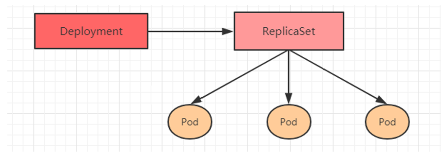
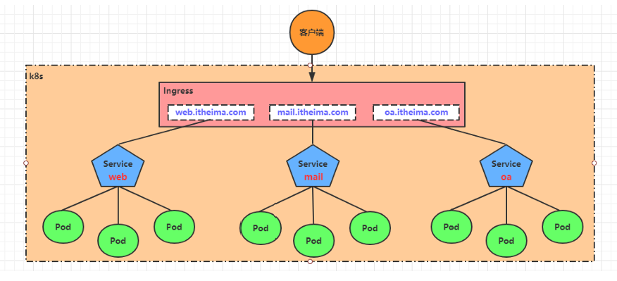
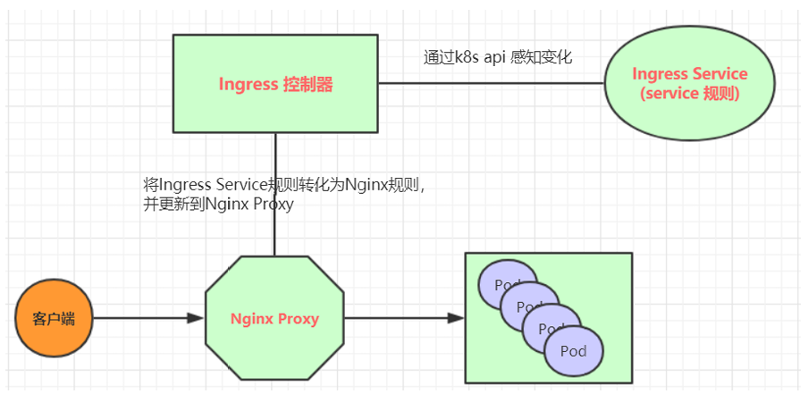

## 前言
在上一节课上学姐给大家讲解了pod的概念，提到了pod的**生命周期，探针**的概念  
在这一节课我们继续深入

## pod 控制器
控制器是什么？一句话概括
Pod 控制器是 Kubernetes 中用于管理 Pod 生命周期的核心组件，它扮演着“自动化管家”的角色，确保集群中 Pod 的实际运行状态始终与用户定义的期望状态保持一致。
主要的控制器是

- Deployment 和 ReplicaSet （替换原来的资源 ReplicationController）。 Deployment 很适合用来管理你的集群上的无状态应用，Deployment 中的所有 Pod 都是相互等价的，并且在需要的时候被替换。  

- StatefulSet 让你能够运行一个或者多个以某种方式跟踪应用状态的 Pod。 例如，如果你的负载会将数据作持久存储，你可以运行一个 StatefulSet，将每个 Pod 与某个 PersistentVolume 对应起来。你在 StatefulSet 中各个 Pod 内运行的代码可以将数据复制到同一 StatefulSet 中的其它 Pod 中以提高整体的服务可靠性。  

- DaemonSet 定义提供节点本地支撑设施的 Pod。这些 Pod 可能对于你的集群的运维是非常重要的， 例如作为网络链接的辅助工具或者作为网络插件的一部分等等。 每次你向集群中添加一个新节点时，如果该节点与某 DaemonSet 的规约匹配，则控制平面会为该 DaemonSet 调度一个 Pod 到该新节点上运行。  

- Job 和 CronJob 提供不同的方式来定义一些一直运行到结束并停止的任务。 你可以使用 Job 来定义只需要执行一次并且执行后即视为完成的任务。你可以使用 CronJob 来根据某个排期表来多次运行同一个 Job(定期执行)。  

#### deployment
deployment是最常用的一种控制器，常用于管理无状态应用（如 Web 服务器、API 服务）。支持滚动更新（Rolling Update）、回滚、扩缩容。它通过管理 ReplicaSet 来间接管理 Pod。  
**核心特点**：
- 副本管理：确保始终有指定数量的 Pod 在运行。
- 滚动更新：更新版本时，先启动新版本，再关闭旧版本，实现零停机。
- 一键回滚：如果新版本出问题，可以瞬间退回到上一个稳定版本。



```txt
注：
上面提到的有状态还有无状态服务是两种不同的服务架构设计方式，核心区别在于服务是否会“记住”客户端的信息。常见的例如 nginx 服务为无状态 数据库 为有状态
```


**简单示例**；
```yml
apiVersion: apps/v1
kind: Deployment
metadata:
  name: nginx-deployment
  labels:
    app: nginx
spec:
  replicas: 3  # 期望的副本数量
  selector:
    matchLabels:
      app: nginx
  strategy:
    type: RollingUpdate  # 滚动更新策略
    rollingUpdate:
      maxSurge: 1        # 更新时最多允许超出期望值的 Pod 数
      maxUnavailable: 1  # 更新时最多允许不可用的 Pod 数
  template:
    metadata:
      labels:
        app: nginx
    spec:
      containers:
      - name: nginx
        image: nginx:alpine
        ports:
        - containerPort: 80
```

```bash
# 部署
kubectl apply -f deployment_try.yml
# 查看
kubectl get pod
```

#### StatefulSet
核心特点：
- 稳定的网络标识：Pod 的名字是固定的（如 web-0, web-1），不会变。
- 稳定的存储：每个 Pod 绑定一个持久化存储卷（PVC）。即使 Pod 被删除重建，数据依然存在。
- 有序部署：Pod 会按顺序（0, 1, 2...）依次启动，避免主从冲突。

**简单示例**

```yml
apiVersion: apps/v1
kind: StatefulSet
metadata:
  name: web
spec:
  serviceName: "nginx"  # 必须对应一个 Headless Service 的名字
  replicas: 3
  selector:
    matchLabels:
      app: nginx
  template:
    metadata:
      labels:
        app: nginx
    spec:
      containers:
      - name: nginx
        image: nginx:alpine
        ports:
        - containerPort: 80
          name: web
        volumeMounts:
        - name: www
          mountPath: /usr/share/nginx/html
  volumeClaimTemplates:  # 定义持久化存储模板，这里可选
  - metadata:
      name: www
    spec:
      accessModes: [ "ReadWriteOnce" ]
      resources:
        requests:
          storage: 1Gi
```  

#### DaemonSet
核心特点：
- 每个节点运行一个：确保集群中的每个（或符合条件的）节点上都运行且仅运行一个 Pod 副本。
- 自动适应：当有新节点加入集群时，它会自动在新节点上启动 Pod；节点移除时自动清理。

daemonset一个节点运行一个pod的特性很适合 日志收集 监控代理 网络插件 这些服务   

下面我在我的每一个节点都输出一段话
**简单示例**
```yml
apiVersion: apps/v1
kind: DaemonSet
metadata:
  name: node-echo
  labels:
    app: node-echo
spec:
  selector:
    matchLabels:
      name: node-echo
  template:
    metadata:
      labels:
        name: node-echo
    spec:
      # 确保能调度到 Master 节点
      tolerations:
      - operator: Exists
      containers:
      - name: echo-container
        image: busybox
        command: ["sh", "-c", "echo '你好！我是节点 $(NODE_NAME)，我正在运行！' && sleep 3600"]
        env:
        - name: NODE_NAME
          valueFrom:
            fieldRef:
              fieldPath: spec.nodeName
```

#### Job和CronJob
job用于一次性任务（执行完成后终止的 Pod），确保任务成功完成。适用场景：数据备份、批量计算、初始化操作等短期任务。  
它会一直运行到任务结束，并且如果任务失败它也会根据配置重启任务

而cronjob在 Job 的基础上增加了时间计划（Cron 表达式）。它可以周期性运行按照设定的时间自动创建 Job 来执行任务。

job：
```yml
apiVersion: batch/v1
kind: Job
metadata:
  name: demo-job
spec:
  backoffLimit: 3  # 失败重试次数
  template:
    spec:
      containers:
      - name: busybox
        image: busybox
        command: ["sh", "-c", "for i in 1 2 3 4 5 6 7 8 9; do echo $i; done"]
      restartPolicy: Never  # 必须设置为 Never 或 OnFailure
```

cronjob:
```yml
apiVersion: batch/v1
kind: CronJob
metadata:
  name: hello-cronjob
spec:
  schedule: "*/1 * * * *"  # Cron 表达式：每分钟
  jobTemplate:
    spec:
      template:
        spec:
          containers:
          - name: busybox
            image: busybox
            command: ["echo", "Hello from CronJob!"]
          restartPolicy: OnFailure
```
#### 金丝雀部署
Deployment控制器支持更新过程中的控制，如“暂停(pause)”或“继续(resume)”更新操作。  
比如有一批新的Pod资源创建完成后立即暂停更新过程，此时，仅存在一部分新版本的应用，主体部分还是旧的版本。然后，再筛选一小部分的用户请求路由到新版本的Pod应用，继续观察能否稳定地按期望的方式运行。确定没问题之后再继续完成余下的Pod资源滚动更新，否则立即回滚更新操作。这就是所谓的金丝雀发布。

这里我按照上面deployment的示例来演示

示例：
```yml
apiVersion: apps/v1
kind: Deployment
metadata:
  name: nginx-v2
spec:
  replicas: 1
  selector:
    matchLabels:
      app: nginx
      version: v2
  template:
    metadata:
      labels:
        app: nginx
        version: v2
    spec:
      containers:
      - name: nginx
        image: nginx:alpine
        ports:
        - containerPort: 80
```

```bash
# 部署迁移
kubectl scale deployment nginx --replicas=0

kubectl scale deployment nginx-v2 --replicas=3
```
大概流程就是这样，但是我们还有更方便的方法
```bash

kubectl set image deployment/nginx-deployment nginx=nginx:latest
# 回滚更新
kubectl rollout pause deployment/nginx-deployment

# 查看
kubectl get pods

# 恢复更新
kubectl rollout resume deployment/myapp-deployment

# 回滚
kubectl rollout undo deployment/myapp-deployment
```

## 服务发现
传统的部署应用服务方式都是直接部署在给定的机器上，访问服务时，我们只需要访问该机器的IP即可。  
但K8s集群中的应用都是通过Pod去部署的，而 pod 生命周期是短暂的。在 Pod 的生命周期过程中，比如它创建或销毁，它的 IP 地址都会发生变化，这样就不能使用传统的部署方式，不能指定 IP 去访问指定的应用。

## service类型
- ClusterIP：默认值，它是Kubernetes系统自动分配的虚拟IP，只能在集群内部访问
- NodePort：将Service通过指定的Node上的端口暴露给外部，通过此方法，就可以在集群外部访问服务
- LoadBalancer：使用外接负载均衡器完成到服务的负载分发，注意此模式需要外部云环境支持
- ExternalName： 把集群外部的服务引入集群内部，直接使用  
  

下面我们具体了解一下前两个

#### clusterip
- 默认类型，用于集群内部访问。
- 为 Service 分配一个集群内部的 IP 地址（ClusterIP），并且仅允许在集群内部访问。
- 外部无法直接访问此类型的 Service。

适用场景：内部通信、后端服务等。

```yml
apiVersion: v1
kind: Service
metadata:
  name: my-service
spec:
  selector:
    app: myapp
  ports:
    - protocol: TCP
      port: 80
      targetPort: 8080
```
#### NodePort
- 使 Service 能够通过集群的所有 Node IP 地址和指定的端口号进行访问。
- Kubernetes 会在每个 Node 上分配一个端口（通常是 30000 到 32767 之间的端口），外部可以通过 NodeIP:NodePort 来访问服务。

适用场景：需要从集群外部访问服务，或者没有外部负载均衡器的环境。

```yml
apiVersion: v1
kind: Service
metadata:
  name: my-service
spec:
  selector:
    app: myapp
  ports:
    - protocol: TCP
      port: 80
      targetPort: 8080
      nodePort: 30001
  type: NodePort
```

## ingress 和ingress route
在上面提到，Service对集群之外暴露服务的主要方式有两种：NotePort和LoadBalancer，
但是这两种方式，都有一定的缺点：
- NodePort方式的缺点是会占用很多集群机器的端口，那么当集群服务变多的时候，这个缺点就愈发明显
- LB方式的缺点是每个service需要一个LB，浪费、麻烦，并且需要kubernetes之外设备的支持  
  
基于这种现状，kubernetes提供了Ingress资源对象，Ingress只需要一个NodePort或者一个LB就可以满足暴露多个Service的需求。工作机制大致如下图表示：  



实际上，Ingress相当于一个7层的负载均衡器，是kubernetes对反向代理的一个抽象，它的工作原理类似于Nginx，可以理解成在**Ingress里建立诸多映射规则，Ingress Controller通过监听这些配置规则并转化成Nginx的反向代理配置 , 然后对外部提供服务**。在这里有两个核心概念：

- Ingress：kubernetes中的一个对象，作用是定义请求如何转发到service的规则
- ingress controller：具体实现反向代理及负载均衡的程序，对ingress定义的规则进行解析，根据配置的规则来实现请求转发，实现方式有很多，比如Nginx, traefik，Contour, Haproxy等等

Ingress（以Nginx为例）的工作原理如下：
- 1.用户编写Ingress规则，说明哪个域名对应kubernetes集群中的哪个Service
- 2.Ingress控制器动态感知Ingress服务规则的变化，然后生成一段对应的Nginx反向代理配置
- 3.Ingress控制器会将生成的Nginx配置写入到一个运行着的Nginx服务中，并动态更新
- 4.到此为止，其实真正在工作的就是一个Nginx了，内部配置了用户定义的请求转发规则



**总结**

| 暴露方式 | 访问方式 |
| :--- | :--- |
| Nodeport + deployment | NodeIP:NodePort |
| Loadbalancer + service + deployment | 负载均衡器IP:Port |
| IngressRoute + service + deployment | 域名或IP |

##  作业：
部署两个服务到k8s上，使用ingress + service + deplotment方式暴露服务，将整个部署文档记录下来，发到tantao@lanshan.email